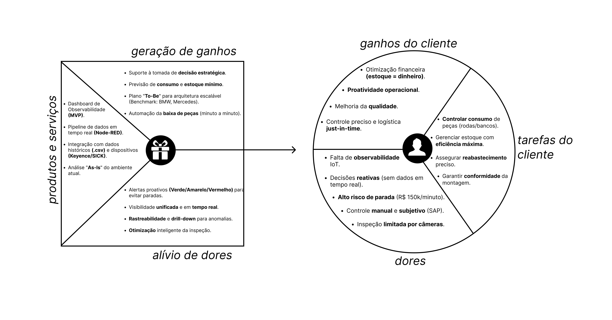

# S1_Canvas_PropostaDeValor.md

Figura 01 - Canva Value Proposition

Source: Material produzido pelo Time Sem Parar, 2025.

### 1. Perfil do Cliente
&nbsp; O Perfil do Cliente no Value Proposition Canvas caracteriza uma representação embasada do público-alvo, organizada em três dimensoes inter-relacionas que, em conjunto, oferecem uma compreensão holística das necessidades e expectativas do cliente (OSTERWALDER, 2014).

&nbsp; No projeto, o cliente é representado pelas áreas de Operação e Logística da Volkswagen do Brasil, responsáveis pela eficiência da linha de montagem.

#### Tarefas do Cliente

- **Funcionais**: Controlar o consumo de peças (rodas e bancos) conforme a demanda da linha de montagem; gerenciar o fluxo de peças para manter o estoque mínimo e seguro; garantir o reabastecimento no momento e local corretos.

- **Sociais/Emocionais**: Assegurar uma operação confiável e em conformidade com os planos de controle; minimizar o risco de falhas operacionais que impactem a produção.

#### Dores

- **Fricções Operacionais**: Controle de estoque dependente de processos manuais e intuição do operador, utilizando o SAP de forma limitada; recursos de inspeção por câmera limitados, impossibilitando o controle de 100% dos itens.

- **Riscos**: Arquitetura IoT sem observabilidade unificada, levando a decisões operacionais reativas; alto risco de paralisação da linha de produção, com um custo potencial de R$ 150.000 por minuto parado (para o modelo Nivus) (TAPI VW, 2025).

#### Ganhos

- **Desejos**: Obter um controle preciso e automatizado; implementar uma logística verdadeiramente just-in-time.

- **Métricas de Sucesso**: Maximização da eficiência do fluxo de peças (estoque mínimo); redução do índice de peças rejeitadas; capacidade de tomada de decisão proativa.

- **Experiência Desejada**: Transição de um modelo reativo para um estratégico, com visibilidade total e confiável sobre a operação.

### 2. Proposta de Valor

&nbsp; A solução proposta é um Painel de Observabilidade de IoT (MVP) para o gerenciamento de consumo e estoque de peças.

#### Produtos e Serviços

- **Dashboard Interativo (MVP)**: Painel de controle centralizado e intuitivo para a arquitetura IoT.

- **Pipeline de Dados em Tempo Real**: Desenvolvido com tecnologias da Indústria 4.0 (Node-RED) para governança e tratamento de dados.

- **Integração com Ambiente Existente**: Utilização de dados históricos (.csv) e mapeamento dos dispositivos IoT atuais (leitores Keyence e SICK) em uma análise "As-Is".

#### Alívio das dores

- **Falta de Observabilidade** → Dashboard centralizado fornece visibilidade unificada.

- **Decisões Reativas** → Visualização de dados em tempo real com capacidade de drill-down permite análise proativa.

- **Risco de Paralisação** → Sistema de alertas (Verde/Amarelo/Vermelho) notifica proativamente sobre estoque baixo, baseado no comportamento anterior analisado das filas de produção na esteira. 

- **Controle Manual/Subjetivo** → Automação do pipeline de dados e da baixa de peças elimina a dependência da intuição.

#### Geração de ganhos

- **Otimização Financeira** → Previsão de consumo baseada em histórico permite a manutenção do estoque mínimo seguro.

- **Proatividade Operacional** → O produto final permite a tomada de decisão estratégica antes do surgimento de gargalos.

- **Melhoria de Qualidade** → A análise de dados auxilia na identificação de causas-raiz de defeitos, aprimorando o tempo de montagem e evitando desentendimentos na linha. 

- **Controle Preciso** → Implementação de um método para dar baixa nas peças a cada minuto, alinhado ao conceito just-in-time.

### 3. Evidências e Aderência

| Necessidade do Cliente | Funcionalidade da Solução | KPI para Validação |
| :--- | :--- | :--- |
| Controle preciso de consumo | Dashboard com dados em tempo real e baixa automática | N/A |
| Evitar paradas na linha | Sistema de alertas proativos (V/A/V) | N/A |
| Otimizar estoque | Previsão de consumo baseada em histórico | N/A |
| Priorizar inspeções | Análise estatística de dados históricos | N/A |

### 4. Referências

TAPI VW 2025. 1. ed. São Paulo, SP: Volkswagen, 2025. Acesso em: 22 out. 2025.

OSTERWALDER, Alex et al. Value Proposition Design: How to Create Products and Services Customers Want. 1. ed. New Jersey: John Wiley & Sons, 2014. Acesso em: 22 out. 2025.