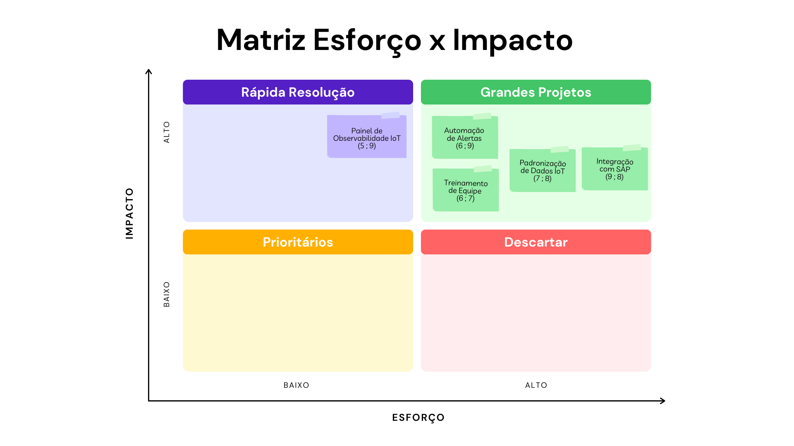

# S1_Impacto_Industria4.0.md

# Análise de Impacto da Indústria 4.0  
**Sprint 1 – Projeto: Painel de Observabilidade IoT (Rodas e Bancos)**

---

## 1. Conceitos e Pilares

### 1.1 Definição
Indústria 4.0 refere-se à quarta revolução industrial, caracterizada pela integração entre automação, Internet das Coisas industrial (IoT), sistemas ciberfísicos, análise de dados em tempo real e tomadas de decisão suportadas por algoritmos. A aplicação desses elementos transforma fluxos produtivos tradicionais em processos conectados e observáveis (Kalsoom et al., 2021).

### 1.2 Pilares aplicáveis ao projeto
No escopo deste projeto, destacam-se três pilares principais:
- **Automação** — execução de tarefas padronizadas por sistemas/atuadores com menor intervenção humana (SAS, s.d.).  
- **IoT** — sensores e leitores que coletam dados de processo em tempo real para alimentar pipelines e dashboards (Kalsoom et al., 2021).  
- **Integração ciberfísica** — conexão entre equipamentos físicos (leitores Keyence e SICK) e sistemas digitais (Node-RED, pipeline, dashboard), permitindo visibilidade e ações baseadas em dados (Volkswagen do Brasil, 2025).

### 1.3 Mapeamento no projeto (contexto TAPI)
O projeto propõe desenvolver um pipeline de dados e um painel de observabilidade para o controle de consumo de peças (rodas e bancos) na linha de montagem. A TAPI descreve a arquitetura atual, os tipos de leitores (Keyence e SICK), o uso de Node-RED e a limitação de dados aos últimos 2 meses para o MVP — informações que fundamentam o escopo e as premissas do relatório (Volkswagen do Brasil, 2025).

---
## 2. Impactos Operacionais Positivos

### 2.1 Benefícios esperados (síntese)
- **Aumento de eficiência operacional**: com dados em tempo real e visibilidade de gargalos, espera-se reduzir o tempo de ciclo por peça (Kalsoom et al., 2021).  
- **Redução de custos e retrabalho**: identificação precoce de anomalias permite intervenções direcionadas, diminuindo custos não previstos (Alshahrani, 2023).  
- **Melhoria na rastreabilidade**: sensores e pipeline garantem trilhas de consumo por id/modelo, suportando auditoria e análise de causa raiz (Kalsoom et al., 2021).  
- **Redução de erros humanos**: automação das leituras e integração reduzem operações manuais susceptíveis a falhas (Alsaadi, 2022).

### 2.2 Tabela “Antes → Depois” (estimativas coerentes)

| Indicador                          | Situação — Antes (estimativa)          | Situação — Depois (estimativa)               |
|------------------------------------|----------------------------------------|---------------------------------------------|
| Tempo médio de montagem por veículo| 4,5 minutos                            | 3,2 minutos (-29%)                           |
| Percentual de rejeições por erro   | 3,0%                                   | 1,5% (-50%)                                  |
| Custo com falhas não previstas     | R$ 120.000 / trimestre                 | R$ 84.000 / trimestre (-30%)                |
| Visibilidade do consumo de peças   | Relatórios diários manuais             | Dashboard em tempo real (latência < 5 min)  |

Essas estimativas seguem o padrão de ganhos observados em estudos de adoção de IoT/Industry 4.0, que apontam reduções significativas em retrabalho e melhoria de eficiência quando a arquitetura é bem projetada (Kalsoom et al., 2021; Alshahrani, 2023).

---

## 3. Desafios e Limitações

### 3.1 Principais barreiras identificadas
- **Custo inicial elevado**: aquisição de sensores, rede, integração e testes é frequentemente citada como barreira principal por empresas que adotam Industry 4.0 (Alshahrani, 2023).  
- **Integração com sistemas legados**: conformidade e interoperabilidade com MES/SAP exigem esforço arquitetural; a TAPI explicita que o MVP não integrará SAP/MES (limitação de escopo), exigindo uma estratégia de integração futura (Volkswagen do Brasil, 2025).  
- **Capacitação da força de trabalho**: falta de skills em IoT/dados é barreira comum, frequentemente listada entre as top-priorities para adoção (Alsaadi, 2022).  
- **Segurança e governança de dados**: dispositivos dispersos e múltiplos pontos de integração aumentam superfície de ataque; padronização e controles são necessários (Alshahrani, 2023).

### 3.2 Estratégias de mitigação propostas
1. **Piloto controlado (escopo reduzido)** — iniciar somente com a estação de montagem de rodas (reduz risco e custo inicial; valida hipóteses operacionais).  
2. **Treinamento por papéis** — programas curtos para operadores, manutenção e TI (foco prático em troubleshooting, interpretação de KPIs e governança de dados).  
3. **Arquitetura modular e APIs** — projetar o pipeline e o dashboard com APIs e formatos padrão (JSON/OPC-UA), facilitando posterior integração com SAP/MES quando autorizado (Volkswagen do Brasil, 2025).  
4. **Plano de segurança básico** — segmentação de rede OT/IT, autenticação de dispositivos e logs de auditoria para tráfego IoT.

---

## 4. Visualizações

### 4.1 Matriz Impacto × Esforço  

---

## 5. Conclusão e próximos passos
A implementação do painel de observabilidade IoT, ainda que dentro das restrições do MVP, tem alto potencial para reduzir tempo de montagem, diminuir taxas de rejeição e aumentar a acurácia operacional. A recomendação imediata é executar o **piloto** conforme descrito na TAPI, validar os KPIs da Tabela “Antes→Depois” em ambiente controlado, e então iterar com foco em integração modulada e capacitação.

---

## 6. Referências

KALSOOM, T.; AHMED, S.; RAFI-UL-SHAN, P. M.; AZMAT, M.; AKHTAR, P.; PERVEZ, Z.; IMRAN, M. A.; UR-REHMAN, M. Impact of IoT on Manufacturing Industry 4.0: A New Triangular Systematic Review. *Sustainability*, v. 13, n. 22, art. 12506, 2021. Disponível em: <https://www.mdpi.com/2071-1050/13/22/12506>. Acesso em: 22 out. 2025.

ALSAADI, N. Modeling and Analysis of Industry 4.0 Adoption Challenges in the Manufacturing Industry. *Processes*, v. 10, n. 10, art. 2150, 2022. Disponível em: <https://www.mdpi.com/2227-9717/10/10/2150>. Acesso em: 22 out. 2025.

ALSHAHRANI, S. T. Industry 4.0 in “Major Emerging Markets”: A Systematic Literature Review of Benefits, Use, Challenges, and Mitigation Strategies in Supply Chain Management. *Sustainability*, v. 15, n. 20, art. 14811, 2023. Disponível em: <https://www.mdpi.com/2071-1050/15/20/14811>. Acesso em: 22 out. 2025.

SAS Institute. Industry 4.0 – the fourth industrial revolution. SAS Insights. Disponível em: <https://www.sas.com/pt_br/insights/big-data/industry-4-0.html>. Acesso em: 22 out. 2025.
