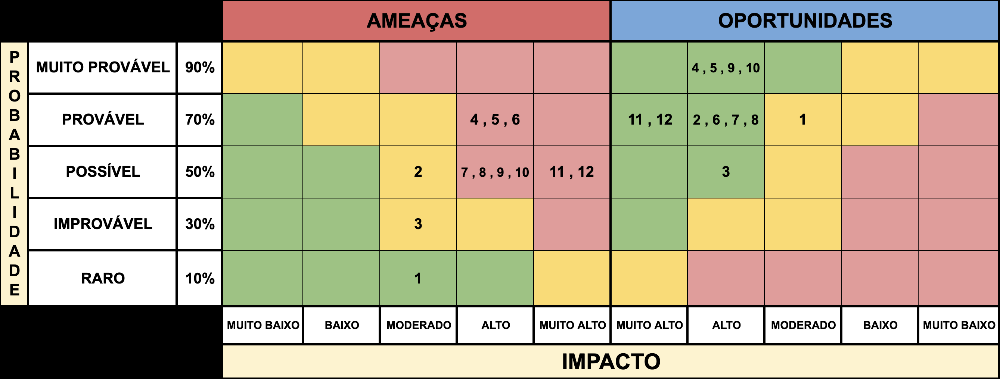

# MATRIZ DE RISCOS (Sprint 1)

## Introdução
A matriz de riscos é uma ferramenta de gestão que permite identificar, avaliar e monitorar os principais eventos que podem impactar o andamento e os resultados de um projeto. Por meio dela, é possível antecipar ameaças, aproveitar oportunidades e planejar ações preventivas e corretivas de forma estruturada.

No contexto deste projeto desenvolvido em parceria com a Volkswagen, a matriz de riscos foi elaborada para garantir maior previsibilidade nas entregas, alinhamento entre equipe e parceiro e controle sobre aspectos técnicos, acadêmicos e operacionais. Cada risco foi avaliado quanto à sua probabilidade e impacto, resultando em planos de mitigação e contingência que asseguram a continuidade e a qualidade do desenvolvimento do MVP.

## Estrutura da Matriz

- A matriz está dividida em dois grupos principais:

  - **Ameaças:** Eventos/riscos que podem prejudicar ou comprometer o sucesso do projeto.

  - **Oportunidades:** Aspectos que, quando bem explorados, podem gerar benefícios relevantes.

- Cada risco é analisado com base em:

  - **Probabilidade (Raro: 10% | Improvável: 30% | Possível: 50% | Provável: 70% | Muito Provável: 90%):** Chance estimada de o risco se concretizar.

  - **Impacto (Muito Baixo | Baixo | Moderado | Alto | Muito Alto):** Consequência esperada caso o risco se realize.
      

  Matriz de Riscos 

  Fonte: do próprio grupo

---

### Lista dos Riscos

1. **Ameaça:** Conflitos internos entre membros da equipe e diversidade de visão — **10% / Moderado**  
   **Oportunidade:** Colaboração e diversidade como diferencial criativo — **70% / Moderado**

2. **Ameaça:** Diferença entre dados simulados e dados reais — **50% / Moderado**  
   **Oportunidade:** Análise comparativa entre dados simulados e reais — **70% / Alto**

3. **Ameaça:** MVP não reflete indicadores industriais comparados ao benchmarking — **30% / Moderado**  
   **Oportunidade:** Integração de métricas fabris e benchmarking — **50% / Alto**

4. **Ameaça:** Falha na integração simulada em ambiente acadêmico — **70% / Alto**  
   **Oportunidade:** Aprendizado técnico sobre protocolos IoT — **90% / Alto**

5. **Ameaça:** Falha de alinhamento entre grupo e Volkswagen sobre o escopo técnico — **70% / Alto**  
   **Oportunidade:** Comunicação contínua e validação quinzenal — **90% / Alto**

6. **Ameaça:** Dados simulados não representam a variabilidade real da produção — **70% / Alto**  
   **Oportunidade:** Criação de base de dados sintética aprimorada — **70% / Alto**

7. **Ameaça:** Desalinhamento entre viabilidade técnica e expectativas do parceiro — **50% / Alto**  
   **Oportunidade:** Alinhamento contínuo de expectativas e escopo — **70% / Alto**

8. **Ameaça:** Falha na integração simulada entre sensores IoT e Node-RED — **50% / Alto**  
   **Oportunidade:** Simulação aprimorada e modularização técnica — **70% / Alto**

9. **Ameaça:** Descompasso entre prazos acadêmicos e ciclos da Volkswagen — **50% / Alto**  
   **Oportunidade:** Planejamento conjunto com a Volkswagen — **90% / Alto**

10. **Ameaça:** Redução de engajamento da Volkswagen em fases intermediárias — **50% / Alto**  
    **Oportunidade:** Fortalecimento do relacionamento com o parceiro — **90% / Alto**

11. **Ameaça:** MVP não reflete indicadores industriais relevantes — **50% / Muito Alto**  
    **Oportunidade:** Padronização do MVP com métricas industriais — **70% / Muito Alto**

12. **Ameaça:** Incompatibilidade do pipeline com políticas de rede e segurança da Volkswagen — **50% / Muito Alto**  
    **Oportunidade:** Conformidade com políticas de rede e segurança — **70% / Muito Alto**

---

## Explicação dos Riscos

### 1.
**AMEAÇA:** Conflitos internos entre membros da equipe e diversidade de visão — **10% / Moderado**  
O risco de conflitos internos entre os membros da equipe foi avaliado com baixa probabilidade (10%) e impacto moderado. Isso ocorre porque é o primeiro módulo em que o grupo trabalha junto, o que pode gerar divergências de visão e ritmo de trabalho. Caso o risco se concretize, pode haver dificuldades na tomada de decisão, atrasos em entregas e sobrecarga em alguns membros. O risco é considerado de severidade moderada, já que, embora improvável, pode afetar o clima do grupo e a produtividade, mas não com um impacto tão alto.
**Severidade:** Moderada  
**Sinais de alerta:** divergências frequentes em reuniões, falta de consenso em decisões e desmotivação entre integrantes.

**OPORTUNIDADE:** Colaboração e diversidade como diferencial criativo — **70% / Moderado**  
A diversidade de perfis e perspectivas do grupo pode ser um ponto forte. O conjunto de ideias diferentes possibilita abordagens inovadoras, ampliando a capacidade de solucionar problemas de forma criativa. Além disso, essa diversidade pode gerar um ambiente de troca de aprendizados, fortalecendo o desenvolvimento interpessoal e técnico da equipe.
**Severidade:** Moderada  

**Plano de mitigação e contingência:** Promover reuniões de alinhamento e feedback, incentivar escuta ativa e respeito às ideias individuais. Caso o conflito aconteça, o líder e o professor devem intermediar a situação e redistribuir funções se necessário.

**Responsável:** Scrum Master  
**Prazo:** Contínuo

---

### 2.
**AMEAÇA:** Diferença entre dados simulados e dados reais — **50% / Moderado**  
O risco de haver diferenças significativas entre os dados simulados e os reais foi avaliado com probabilidade moderada (50%) e impacto moderado. Isso pode ocorrer pela falta de acesso direto aos dados fabris, o que pode limitar a precisão dos resultados. Se o risco se concretizar, o MVP pode apresentar inconsistências e reduzir a confiabilidade dos resultados.
**Severidade:** Moderada  
**Sinais de alerta:** resultados inconsistentes entre bases, valores fora do padrão ou ausência de variáveis relevantes.

**OPORTUNIDADE:** Análise comparativa entre dados simulados e reais — **70% / Alto**  
A diferença entre bases pode ser usada como aprendizado técnico para validar metodologias e aprimorar o modelo. Essa comparação permite que o grupo desenvolva senso crítico sobre a qualidade dos dados, aprenda técnicas de limpeza e melhore o tratamento estatístico.
**Severidade:** Alta  

**Plano de mitigação e contingência:** Revisar o dicionário de dados, analisar padrões de divergência e ajustar o MVP conforme novas informações surgirem. Caso persistam discrepâncias, justificar as limitações no relatório final.

**Responsável:** Líder Técnico  
**Prazo:** Sprint 2 e 3

---

### 3.
**AMEAÇA:** MVP não reflete indicadores industriais comparados ao benchmarking — **30% / Moderado**  
O risco foi classificado com 30% de probabilidade e impacto moderado, pois há chance de o MVP não representar indicadores industriais utilizados por outras empresas do setor. Isso pode gerar dúvidas sobre a aplicabilidade do resultado.
**Severidade:** Moderada  
**Sinais de alerta:** divergências entre KPIs apresentados e métricas industriais conhecidas.

**OPORTUNIDADE:** Integração de métricas industriais e benchmarking — **50% / Alto**  
Comparar com indicadores usados por outras operações do setor ajuda a ajustar o MVP aos padrões de mercado, tornando-o mais alinhado ao que as empresas realmente utilizam e facilitando a validação junto à Volkswagen.
**Severidade:** Alta  

**Plano de mitigação e contingência:** Revisar os principais KPIs, comparar com parâmetros usados em outras operações do setor e ajustar o painel conforme feedback do parceiro.

**Responsável:** Product Owner  
**Prazo:** Sprint 3

---

### 4.
**AMEAÇA:** Falha na integração simulada em ambiente acadêmico — **70% / Alto**  
Há uma probabilidade alta (70%) de ocorrerem falhas técnicas pelas limitações de rede e infraestrutura do ambiente acadêmico. Essas falhas podem dificultar ou até impedir os testes de integração entre sensores e o Node-RED. Caso aconteçam, o grupo pode perder tempo com tentativas repetidas de conexão, atrasando o cronograma e reduzindo a eficiência das entregas.
**Severidade:** Alta  
**Sinais de alerta:** erros de autenticação, falhas de rede, lentidão no servidor ou desconexões frequentes.

**OPORTUNIDADE:** Aprendizado técnico sobre protocolos IoT — **90% / Alto**  
Mesmo com essas dificuldades, o grupo tem a oportunidade de aprofundar o conhecimento sobre protocolos de comunicação IoT, como MQTT e HTTP, e compreender na prática como esses sistemas se comportam em diferentes contextos. Essa vivência pode contribuir para o aprendizado técnico e ajudar na criação de soluções mais estáveis e modulares para projetos futuros.
**Severidade:** Alta  

**Plano de mitigação e contingência:** Criar um ambiente de simulação local para testar os fluxos antes da integração principal e modularizar os componentes do sistema. Caso o problema persista, documentar os erros e apresentar uma proposta de integração futura com base nos aprendizados obtidos.

**Responsável:** Líder Técnico  
**Prazo:** Sprint 4

---

### 5.
**AMEAÇA:** Falha de alinhamento entre grupo e Volkswagen sobre o escopo técnico — **70% / Alto**  
Há uma probabilidade alta (70%) de ocorrer desalinhamento entre a equipe e a Volkswagen devido a diferentes interpretações do escopo técnico, ao ritmo distinto entre o ambiente acadêmico e o corporativo e à limitação de tempo nas reuniões. Caso isso aconteça, o grupo pode desenvolver partes do MVP fora do foco esperado pelo parceiro, exigindo retrabalho, atrasando o cronograma e comprometendo a confiança na entrega. O impacto é alto, pois qualquer divergência na compreensão do que deve ser entregue pode afetar diretamente a avaliação final do projeto e o relacionamento com o parceiro.
**Severidade:** Alta  
**Sinais de alerta:** feedbacks repetidos pedindo correções de direção, dúvidas recorrentes sobre as prioridades do backlog e solicitações de replanejamento vindas do parceiro.

**OPORTUNIDADE:** Comunicação contínua e validação quinzenal — **90% / Alto**  
Manter uma rotina de reuniões curtas e produtivas com o parceiro permite alinhar as expectativas e ajustar o escopo constantemente. Essa prática garante que o grupo entenda claramente o que é prioridade, evitando retrabalho e fortalecendo o vínculo de confiança com a Volkswagen. Além disso, proporciona aprendizado em gestão de comunicação corporativa e prática de entregas ágeis, habilidades muito valorizadas no mercado.
**Severidade:** Alta  

**Plano de mitigação e contingência:** As reuniões quinzenais já realizadas com a Volkswagen funcionam como o principal meio de alinhamento entre o grupo e o parceiro. Para garantir sua eficácia, é importante manter atas claras de decisões, registrar mudanças no backlog e revisar o escopo técnico a cada encontro. Caso ainda ocorram divergências, o líder de projeto deve reforçar a comunicação direta com o parceiro e redefinir as prioridades de entrega em conjunto.
**Responsável:** Líder de Projeto  
**Prazo:** Contínuo

---

### 6.
**AMEAÇA:** Dados simulados não representam a variabilidade real da produção — **70% / Alto**  
Esse risco é considerado provável (70%) e com impacto alto, pois os dados gerados para a simulação podem não reproduzir de forma realista a complexidade das operações industriais da Volkswagen. Quando as variáveis simuladas (como tempos de processo, falhas ou leituras de sensores) apresentam pouca variação, o sistema deixa de refletir o comportamento dinâmico de uma linha de produção real. Isso reduz a credibilidade da simulação, prejudica as análises e limita o aprendizado do grupo sobre a integração de dados IoT em contextos industriais autênticos.
**Severidade:** Alta  
**Sinais de alerta:** padrões excessivamente estáveis nos gráficos, ausência de desvios ou falhas simuladas e métricas muito constantes entre execuções.

**OPORTUNIDADE:** Criação de base de dados sintética aprimorada — **70% / Alto**  
Essa limitação representa uma oportunidade de aperfeiçoar o processo de simulação, introduzindo maior variabilidade controlada nos dados e explorando comportamentos mais próximos da realidade fabril. Isso enriquece o entendimento da equipe sobre como sistemas industriais funcionam e melhora a capacidade de representar cenários reais em futuras iterações do projeto.
**Severidade:** Alta  

**Plano de mitigação e contingência:** Adicionar pequenas variações nos dados simulados (como tempo ou condição das máquinas) para deixá-los mais realistas. Se o problema continuar, registrar no relatório as limitações e sugerir o uso de dados reais nas próximas versões do projeto.

**Responsável:** Analista de Dados  
**Prazo:** Sprint 4

---

### 7.
**AMEAÇA:** Desalinhamento entre viabilidade técnica e expectativas do parceiro — **50% / Alto**  
Esse risco é provável (50%) e tem impacto alto, pois ocorre quando o parceiro espera resultados além do que é tecnicamente ou academicamente possível. A diferença de linguagem e de expectativas entre o ambiente corporativo e o ambiente acadêmico pode gerar retrabalho, frustração e até comprometer a confiança do parceiro. Mesmo pequenas divergências sobre escopo ou prazos podem afetar a percepção de valor do projeto e a motivação da equipe.
**Severidade:** Alta  
**Sinais de alerta:** pedidos fora do escopo, novas demandas não documentadas e comentários que indiquem descompasso entre o que foi entregue e o que era esperado.

**OPORTUNIDADE:** Alinhamento contínuo de expectativas e escopo — **70% / Alto**  
Esse risco se transforma em uma oportunidade de fortalecer a comunicação com o parceiro e aprimorar a capacidade do grupo em gerir expectativas. Realizar validações constantes ajuda a equilibrar o que é desejável e o que é possível, reforçando a clareza sobre os limites do projeto e aumentando a confiança na parceria.
**Severidade:** Alta  

**Plano de mitigação e contingência:** Manter reuniões quinzenais para revisar escopo e objetivos, confirmando o que foi entregue e o que será feito nas próximas etapas. Caso surjam demandas fora do acordado, o Product Owner deve formalizar os ajustes e comunicar as limitações técnicas de forma transparente.

**Responsável:** Product Owner  
**Prazo:** Contínuo

---

### 8.
**AMEAÇA:** Falha na integração simulada entre sensores IoT e Node-RED — **50% / Alto**  
Esse risco tem probabilidade média (50%) e impacto alto, pois a comunicação entre sensores IoT e o Node-RED depende de múltiplos módulos e conexões em rede. Problemas de compatibilidade, erros de configuração ou travamentos podem interromper o fluxo de dados, comprometendo a coleta e a visualização das informações no painel. Isso afeta diretamente a demonstração do MVP e a compreensão prática da arquitetura IoT pela equipe, além de reduzir o valor técnico da entrega se a integração não puder ser demonstrada de forma funcional.
**Severidade:** Alta  
**Sinais de alerta:** falhas recorrentes na leitura dos sensores, atrasos no envio dos dados, desconexões inesperadas e travamentos do servidor.

**OPORTUNIDADE:** Simulação aprimorada e modularização técnica — **70% / Alto**  
Esse risco abre espaço para o aprendizado técnico em depuração, modularização e arquitetura distribuída. A equipe pode testar a robustez do sistema e criar versões independentes de cada módulo, o que aumenta a confiabilidade geral do projeto. Essa experiência também reforça o domínio dos integrantes sobre ferramentas de automação industrial e protocolos de comunicação.
**Severidade:** Alta  

**Plano de mitigação e contingência:** Testar e validar cada módulo separadamente antes da integração completa, registrar logs detalhados de erro e manter backups dos fluxos funcionais no Node-RED. Caso a falha persista, utilizar simulações controladas ou vídeos demonstrativos para comprovar o funcionamento planejado.

**Responsável:** Líder Técnico  
**Prazo:** Sprint 4

---

### 9.
**AMEAÇA:** Descompasso entre prazos acadêmicos e ciclos da Volkswagen — **50% / Alto**  
Há uma probabilidade moderada (50%) de desalinhamento entre o ritmo acadêmico do Inteli e o calendário corporativo da Volkswagen. Enquanto as sprints do projeto seguem prazos curtos e fixos, o parceiro possui ciclos de trabalho mais longos, o que pode atrasar retornos e validações importantes. Esse descompasso afeta diretamente o andamento das entregas e pode gerar acúmulo de tarefas ou retrabalho nas fases seguintes.
**Severidade:** Alta  
**Sinais de alerta:** demora nas respostas do parceiro pelos canais de comunicação, feedbacks recebidos apenas após o fechamento da sprint e impossibilidade de ajustar entregas dentro do prazo.

**OPORTUNIDADE:** Planejamento conjunto com a Volkswagen — **90% / Alto**  
Esse risco cria uma oportunidade de aprimorar a gestão de tempo e comunicação assíncrona. Ajustar o cronograma interno do grupo considerando o tempo de resposta da VW ajuda a tornar o trabalho mais realista e profissional. Essa prática também ensina a equipe a planejar entregas independentes, que possam evoluir mesmo sem retorno imediato.
**Severidade:** Alta  

**Plano de mitigação e contingência:** Estruturar as entregas de modo que dependam o mínimo possível de validações externas e revisar prioridades ao início de cada sprint. Caso ocorram atrasos nos retornos, documentar o progresso e seguir com as etapas técnicas internas até o próximo ponto de contato com a VW.
**Responsável:** Gestor de Sprint  
**Prazo:** Todas as Sprints

---

### 10.
**AMEAÇA:** Redução de engajamento da Volkswagen em fases intermediárias — **50% / Alto**  
Esse risco tem probabilidade moderada (50%) e impacto alto, pois pode ocorrer uma redução da participação da Volkswagen nas etapas intermediárias do projeto. Isso pode acontecer por limitações de tempo dos profissionais da empresa, mudanças de prioridade interna ou períodos de fechamento operacional. Essa redução de engajamento afeta diretamente o ritmo das entregas, já que o grupo depende do retorno técnico e da validação do parceiro para ajustar o escopo e manter o alinhamento. Além disso, a falta de resposta contínua pode desmotivar a equipe e comprometer a conexão entre o trabalho acadêmico e a realidade industrial.
**Severidade:** Alta  
**Sinais de alerta:** ausência de retorno a e-mails e mensagens, feedbacks curtos ou genéricos, e demora para aprovar ou comentar entregas.

**OPORTUNIDADE:** Fortalecimento do relacionamento com o parceiro — **90% / Alto**  
Esse risco pode se transformar em uma oportunidade de aprimorar a comunicação e consolidar a autonomia da equipe. Enviar relatórios claros, registrar decisões e manter o parceiro atualizado ajuda a demonstrar profissionalismo e compromisso, fortalecendo a confiança da VW no grupo. Além disso, essa prática ensina a equipe a manter a consistência do projeto mesmo com contato reduzido.
**Severidade:** Alta  

**Plano de mitigação e contingência:** Enviar relatórios quinzenais com resumo das entregas e próximos passos. Se o contato diminuir, registrar o progresso e retomar o alinhamento no próximo encontro com o parceiro.
**Responsável:** Líder de Comunicação  
**Prazo:** Contínuo

---

### 11.
**AMEAÇA:** MVP não reflete indicadores industriais relevantes — **50% / Muito Alto**  
Esse risco é provável (50%) e tem impacto muito alto, pois se o MVP não estiver alinhado aos indicadores que a Volkswagen realmente utiliza, o parceiro pode considerar o produto pouco aplicável. Isso compromete o valor estratégico da entrega e reduz a credibilidade do grupo perante a empresa. Mesmo que a solução funcione tecnicamente, a falta de aderência às métricas industriais pode fazer o projeto parecer desconectado da realidade fabril.
**Severidade:** Muito Alta  
**Sinais de alerta:** feedbacks indicando falta de conexão com a operação real, inconsistência entre os KPIs do painel e os relatórios industriais, e dúvidas do parceiro sobre a utilidade prática da solução.

**OPORTUNIDADE:** Padronização do MVP com métricas industriais — **70% / Muito Alto**  
Esse risco cria a chance de aproximar o MVP de práticas reais do setor automotivo. Incorporar indicadores que o parceiro reconhece, como eficiência de processo, tempo de ciclo e disponibilidade de máquinas, demonstra maturidade técnica e aumenta o valor percebido do projeto.
**Severidade:** Muito Alta  

**Plano de mitigação e contingência:** Validar indicadores com o parceiro ao fim de cada sprint e ajustar o painel conforme o feedback recebido. Caso algum KPI não possa ser aplicado, justificar tecnicamente e sugerir alternativas compatíveis.

**Responsável:** Líder Técnico / Product Owner  
**Prazo:** Sprint 4

---

### 12.
**AMEAÇA:** Incompatibilidade do pipeline com políticas de rede e segurança da Volkswagen — **50% / Muito Alto**  
Esse risco é possível (50%) e tem impacto muito alto, pois envolve o cumprimento das diretrizes de segurança digital e rede da Volkswagen. Como o ambiente corporativo possui restrições rígidas de acesso e autenticação, qualquer incompatibilidade no pipeline de dados, como bloqueios de portas, certificados inválidos ou falhas de comunicação, pode impedir o funcionamento do MVP. Além de comprometer a entrega técnica, isso também afeta a imagem do grupo perante o parceiro, já que violações ou falhas de segurança são tratadas com extrema gravidade em contextos industriais.
**Severidade:** Muito Alta  
**Sinais de alerta:** bloqueios de rede, falhas de autenticação, mensagens de erro relacionadas a certificados ou impossibilidade de conexão entre módulos.

**OPORTUNIDADE:** Conformidade com políticas de rede e segurança — **70% / Muito Alto**  
Esse risco gera uma oportunidade de aprendizado prático sobre segurança digital e arquitetura segura de sistemas IoT. Trabalhar dentro das restrições impostas pela VW ajuda o grupo a compreender normas corporativas e a desenvolver soluções mais seguras e confiáveis.
**Severidade:** Muito Alta  

**Plano de mitigação e contingência:** Testar previamente os protocolos de rede em ambiente controlado e simular integrações locais antes da apresentação final. Caso haja bloqueios durante o uso, apresentar o funcionamento do MVP em modo offline e documentar as limitações técnicas de acesso.
**Responsável:** Líder Técnico  
**Prazo:** Contínuo

---

## Quadro RACI Resumido

O quadro RACI (Responsável, Aprovador, Consultado e Informado) resume as funções de cada integrante no gerenciamento dos riscos do projeto. Ele garante clareza sobre as responsabilidades e melhora a comunicação entre a equipe e o parceiro.

| **Atividade / Entregável**                       | **R (Responsável)**  | **A (Aprovador)**      | **C (Consultado)**             | **I (Informado)**        |
|--------------------------------------------------|----------------------|------------------------|--------------------------------|--------------------------|
| Identificação e descrição dos riscos             | Scrum Master         | Líder de Projeto       | Todos os membros da equipe     | Professor orientador     |
| Avaliação de probabilidade e impacto             | Líder Técnico        | Product Owner          | Analista de Dados              | Equipe e parceiro VW     |
| Planejamento de mitigação e contingência         | Líder de Projeto     | Product Owner          | Líder Técnico                  | Equipe                   |
| Monitoramento e atualização da matriz de riscos  | Scrum Master         | Líder de Projeto       | Líder Técnico e Product Owner  | Todos os integrantes     |
| Comunicação dos riscos ao parceiro (Volkswagen)  | Líder de Comunicação | Product Owner          | Líder de Projeto               | Parceiro Volkswagen      |

**Legenda:** R = Responsável | A = Aprovador | C = Consultado | I = Informado
