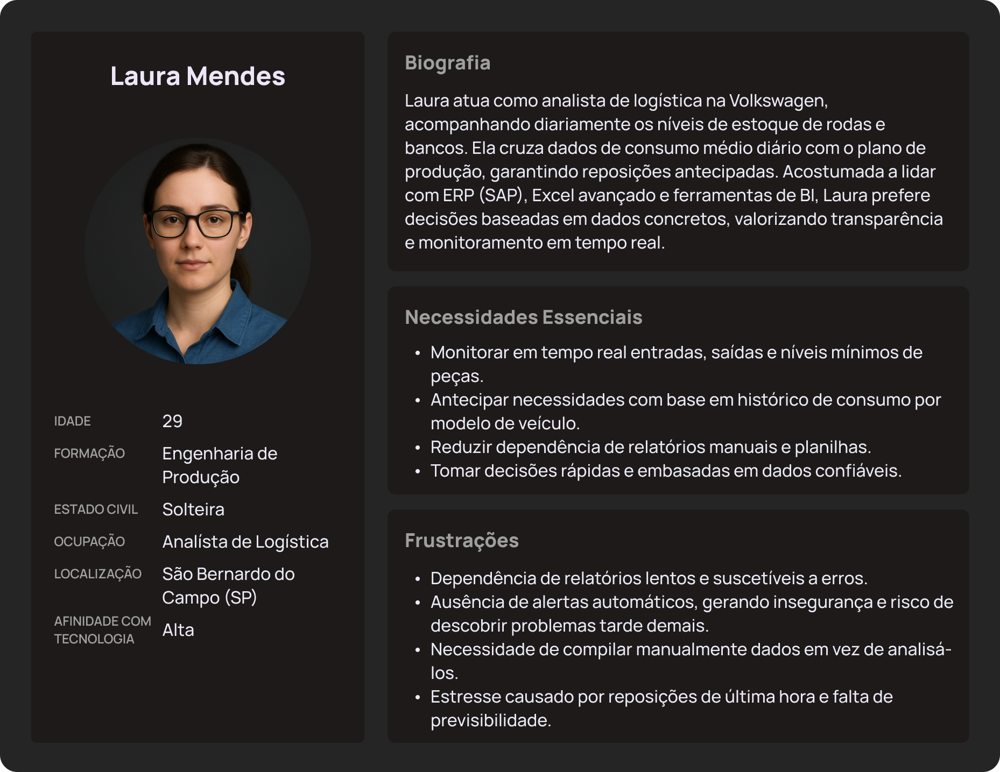
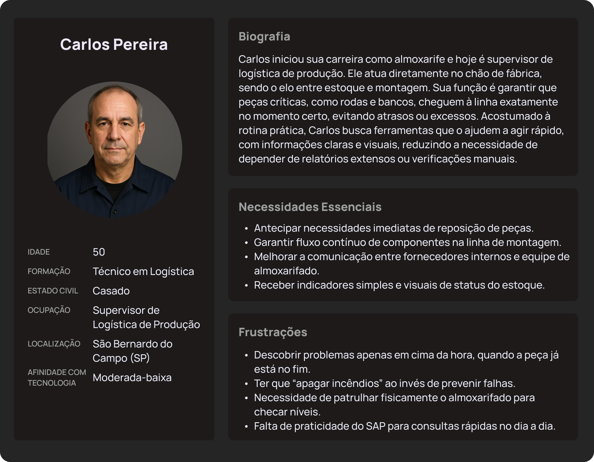
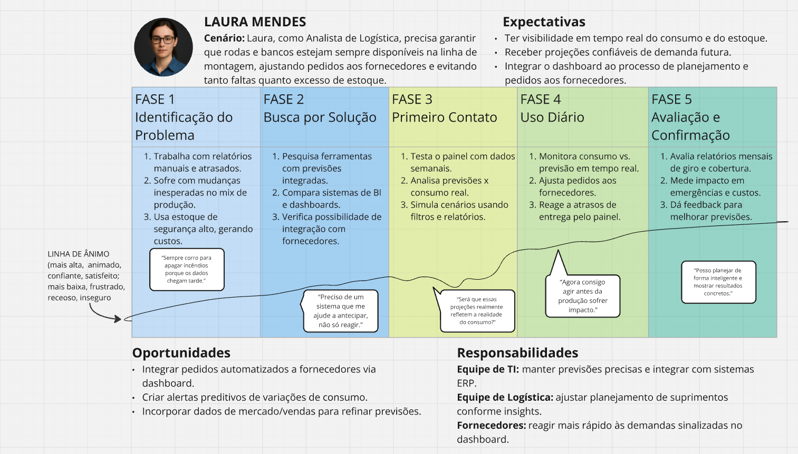
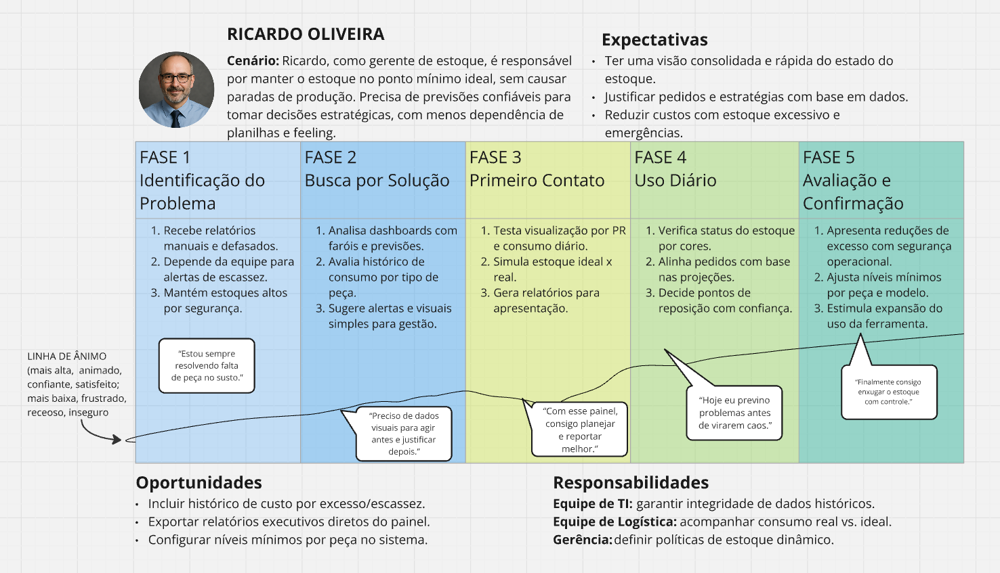
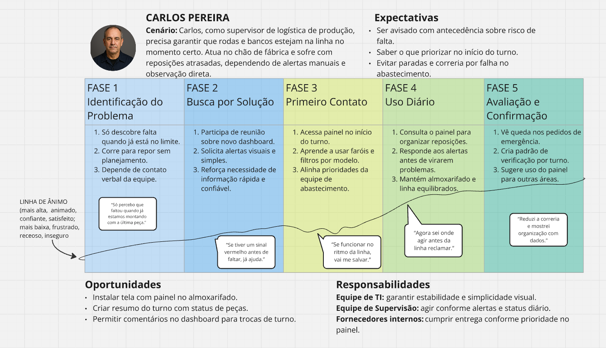
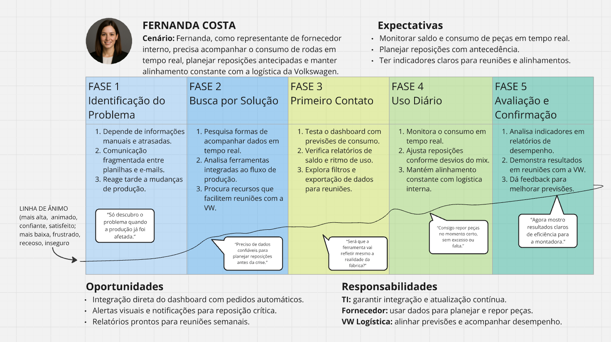

# Personas
As personas deste projeto representam os principais perfis de usuários impactados pela solução, descrevendo suas características, necessidades e frustrações. Elas servem como guia para alinhar o desenvolvimento às expectativas reais, garantindo que as funcionalidades propostas sejam relevantes e tragam valor no contexto da Volkswagen.

[Melhor visualização das personas](https://www.figma.com/design/t3XQfD0lqeWosRjY0bNcNS/G1-ADM?node-id=0-1&p=f&t=7rtr48pE6IBUXJ24-0)

## Analista de Logística

Figura 01: Analista de Logística

Source: Material produzido pelo Time Sem Parar, 2025.

**Nome fictício:** Laura Mendes  
**Cargo:** Analista de Logística

**Contexto profissional:**

Laura Mendes, 29 anos, é Analista de Logística na fábrica da Volkswagen. Formada em Engenharia de Produção, ela é responsável por monitorar o fluxo de peças, especialmente rodas e bancos, garantindo que o estoque se mantenha no nível mínimo seguro. Atua diretamente com o time de logística e o setor de produção, analisando dados e antecipando necessidades para evitar paradas na linha. Seu dia a dia é dinâmico, exigindo atenção constante aos níveis de consumo e reposição das peças.

**Objetivos no uso do dashboard:**

Monitorar em tempo real os níveis de estoque de rodas e bancos, garantindo que nunca caiam abaixo do mínimo de segurança.

Basear suas decisões em dados concretos: por exemplo, calcular o consumo médio diário de cada modelo de veículo (a fábrica monta ~4–5 modelos diferentes) para antecipar necessidades.

Visualizar rapidamente entradas e saídas de peças e identificar tendências de consumo, ajudando a programar reposições antes que ocorram faltas.

Em suma, Laura busca evitar paradas de linha por falta de componentes e otimizar o estoque, tomando decisões rápidas embasadas em informações dos últimos meses de produção.

**Dores e frustrações atuais (sem o sistema):**

Atualmente depende de relatórios do SAP e planilhas manuais, além do próprio feeling, para acompanhar o estoque – um processo lento e suscetível a erros.

Sente insegurança por não ter alertas automáticos: teme descobrir uma baixa crítica de peças tarde demais.

A falta de visualização clara a obriga a gastar tempo compilando dados em vez de analisá-los.

Já ocorreram situações de correria para repor peças no último minuto, gerando estresse e risco de interrupção na produção.

Essa operação “no escuro”, sem um painel intuitivo, frustra Laura, que prefere decisões guiadas por dados confiáveis em vez de puramente experiência.

**Comportamento e jornada de trabalho:**

Inicia o dia checando os níveis de estoque e o consumo dos itens críticos.

Laura planeja consultar o dashboard várias vezes ao dia (pelo menos 2 a 3 vezes: de manhã, após o almoço e no fim do expediente) para monitorar o fluxo de peças em tempo real.

Ela cruza essas informações com o plano de produção diário – por exemplo, se naquele dia montarão mais unidades de um certo modelo, verifica se há rodas e bancos suficientes para atendê-lo.

Durante o expediente, ao notar no painel que algum item se aproxima do limite mínimo, aciona imediatamente o pedido de reposição: comunica o fornecedor interno ou o setor de compras da Volkswagen para repor a peça antes que falte.

Laura também gera relatórios rápidos a partir do dashboard para reuniões diárias, destacando quais componentes precisam de atenção.

Ao final do dia, deixa registrados os pontos de atenção para o próximo turno, garantindo continuidade no controle do estoque.

**Nível de familiaridade com tecnologia e dados:** 

Alto. Laura, 29 anos, tem formação em Engenharia de Produção e está acostumada a lidar com ERP (SAP), planilhas avançadas e ferramentas de Business Intelligence. Sente-se confortável em aprender novos sistemas e valoriza interfaces intuitivas. Por ter crescido imersa em tecnologia, ela se adapta rapidamente ao dashboard e até sugere melhorias. Ela costuma criar gráficos e análises em Excel para projeções de consumo, então abraça facilmente um painel interativo que automatize parte desse trabalho. Para ela, dados são aliados no dia a dia – Laura confia mais nos números do que em suposições, e por isso anseia por um sistema em tempo real que substitua o monitoramento manual e melhore sua produtividade.

## Gerente de Estoque

Figura 02: Gerente de Estoque

Source: Material produzido pelo Time Sem Parar, 2025.

**Nome fictício:** Ricardo Oliveira  
**Cargo:** Gerente de Estoque

**Contexto profissional:** 

Ricardo Oliveira, 45 anos, é Gerente de Estoque na planta da Volkswagen. Com ampla experiência em logística automotiva, ele coordena a gestão dos estoques de componentes críticos da produção. Seu trabalho é equilibrar a disponibilidade de peças e o custo de armazenagem, aplicando os princípios do sistema Just-in-Time. Ricardo lidera equipes de logística e compras, tomando decisões estratégicas com base em indicadores de consumo, giro e cobertura de estoque, sempre visando manter a operação contínua e eficiente.

**Objetivos no uso do dashboard:**

Garantir o estoque mínimo necessário de rodas e bancos para manter a produção contínua, evitando tanto faltas quanto excessos.

Obter uma visão macro dos níveis de estoque e do consumo diário: identificar facilmente se o estoque está dentro do ponto mínimo ideal para suprir a demanda sem sobra exagerada.

Tomar decisões estratégicas rápidas com base nos dados do painel, como ajustar pedidos de compra ou negociar entregas extras com fornecedores, antes que a linha de montagem seja afetada.

Acompanhar indicadores-chave no dashboard (giro de estoque, dias de cobertura, tendência de consumo por modelo) e apresentar resultados à diretoria, mostrando como o novo sistema evita desperdícios e previne paradas na produção por falta de peças.

Em suma, Ricardo vê o dashboard como uma ferramenta para otimizar o estoque de modo enxuto (princípios Just-in-Time), sem comprometer a segurança da operação.

**Dores e frustrações atuais (sem o sistema):**

Falta de visibilidade integrada: o controle via SAP é fragmentado e depende de acompanhamentos manuais e da experiência da equipe.

Já houve sustos com nível crítico de peças descoberto em cima da hora; ele lembra de quase ter tido uma parada de linha por baixa de estoque, o que seria inaceitável – um único minuto de linha parada equivale ao custo de um carro não produzido, um prejuízo enorme.

Por outro lado, manter estoque além do necessário contraria as diretrizes de reduzir custos e imobilização de capital. Esse dilema (arriscar falta vs. sobrar estoque) é uma dor constante.

Sem um dashboard visual, Ricardo precisa solicitar relatórios aos analistas ou extrair dados brutos do SAP, perdendo tempo e podendo interpretar informações defasadas.

A ausência de alertas proativos significa que ele depende de ligações ou e-mails urgentes quando algo sai do controle.

Essa situação gera ansiedade: em um ambiente just-in-time qualquer falha de suprimento é crítica, mas sem uma ferramenta adequada ele se sente “dirigindo no escuro”, reagindo a problemas em vez de preveni-los.

**Comportamento e jornada de trabalho:**

Ricardo, 45 anos, começa o dia revisando os resumos de estoque das principais peças.

Normalmente realiza uma reunião matinal com a equipe de logística e produção, discutindo o plano diário e verificando se há riscos de falta de componentes.

Com o dashboard implantado, ele passará a consultá-lo antes dessas reuniões, obtendo um panorama imediato: por exemplo, se alguma peça estiver marcada em amarelo/vermelho (abaixo do nível seguro), ele já entra na reunião ciente do problema e com um plano de ação.

Ao longo do dia, Ricardo verifica o painel em momentos-chave (início da tarde, fim do dia) ou quando é notificado de alguma anormalidade nos níveis de estoque.

Se o consumo de determinado modelo aumentar, ele usa a informação do dashboard para ajustar pedidos junto aos fornecedores ou redistribuir internamente peças entre as linhas de montagem.

Ele também utiliza o dashboard em reuniões semanais de acompanhamento, analisando tendências de consumo e estoque dos últimos meses para refinar as políticas de estoque mínimo. Por exemplo, se percebe pelo histórico que um modelo está vendendo mais, recalcula – junto com os analistas – o estoque de segurança de rodas para aquele modelo.

No encerramento do mês, Ricardo extrai indicadores consolidados do sistema (como nenhuma falta ocorrida e porcentagem de redução de excesso de estoque) para relatórios gerenciais e para reconhecer a equipe pelo bom desempenho.

**Nível de familiaridade com tecnologia e dados:**

Moderado. Ricardo tem ampla experiência em logística automotiva, tendo testemunhado a evolução do controle de estoque do papel para sistemas ERP. Ele utiliza bem ferramentas corporativas como SAP e Excel para análises básicas, mas não é um especialista técnico. Prefere interfaces gráficas claras, que não exijam muitas manobras para obter informação. A ideia de um dashboard com gráficos de barras e alertas de “farol” (verde, amarelo, vermelho) o agrada pela facilidade de interpretação. Ele se sente confortável navegando em sistemas conhecidos, mas pode precisar de um breve treinamento no novo painel; ainda assim, sua atitude é aberta, pois entende o valor da tecnologia para evitar erros caros. Em termos de dados, Ricardo confia nos números apresentados, mas gosta de ter resumos e destaques visuais em vez de detalhes granulares – ele deixa as minúcias para os analistas. Assim, seu nível de familiaridade permite que ele use o dashboard no dia a dia sem grandes dificuldades, desde que as informações estejam apresentadas de forma objetiva e amigável.

## Supervisor de Logística de Produção

Figura 03: Supervisor de Logística de Produção

Source: Material produzido pelo Time Sem Parar, 2025.

**Nome fictício:** Carlos Pereira  
**Cargo:** Supervisor de Logística de Produção

**Contexto profissional:** 

Carlos Pereira, 50 anos, é Supervisor de Logística de Produção e atua como elo entre o almoxarifado e a linha de montagem. Começou sua carreira como almoxarife e, ao longo dos anos, tornou-se referência na coordenação de abastecimento interno. Seu papel é garantir que rodas, bancos e demais peças cheguem à linha no momento certo, evitando paradas e desperdícios. Carlos trabalha lado a lado com a equipe operacional, acompanhando de perto o ritmo da produção e garantindo o fluxo contínuo de materiais.

**Objetivos no uso do dashboard:**

Assegurar que rodas, bancos e demais peças críticas estejam disponíveis na linha de montagem exatamente quando necessário – nem antes em excesso, nem depois atrasado.

Antecipar necessidades imediatas: por exemplo, se o painel mostrar que o lote de rodas em uso vai se esgotar em poucas horas, Carlos já coordena a reposição antes que acabe, evitando paradas na linha de produção.

Priorizar as tarefas da equipe de almoxarifado: o dashboard ajuda a identificar quais peças precisam ser repostas primeiro durante o turno.

Melhorar a comunicação com os fornecedores internos e o time de logística central – com dados visíveis a todos, ele pode alinhar rapidamente quando algo está crítico.

Em suma, Carlos quer garantir fluxo ininterrupto na montagem, alinhado ao sistema just-in-time da Volkswagen, onde a falta de qualquer item pode ter efeito cascata na produção.

**Dores e frustrações atuais (sem o sistema):**

Na rotina atual, Carlos trabalha de forma reativa. Muitas vezes só descobre que uma peça está no fim quando um operador da linha avisa ou quando já estão usando o último pallet de rodas/bancos.

Essa falta de alerta prévio já causou situações de pânico: ele lembra de vezes em que a equipe teve que correr ao estoque buscar peças de emergência, ou improvisar com peças de outros modelos, para não deixar a linha parar.

Isso é extremamente estressante num ambiente onde a linha não pode parar (manufatura contínua) e qualquer interrupção não planejada é complexa de recuperar.

Carlos fica frustrado por não ter um vislumbre instantâneo do status do estoque; ele acaba precisando patrulhar fisicamente o almoxarifado ou ligar para o analista pedindo atualização.

O SAP, para ele, é pouco prático para consultas rápidas durante o turno.

Ele gostaria de algo simples e visual – por exemplo, um indicador de cor que mostre se tudo está OK ou se algo precisa de atenção imediata.

A falta dessa facilidade hoje o faz sentir que está sempre “apagando incêndios” ao invés de preveni-los.

Ele também tem consciência de que um deslize pode custar caríssimo (cada minuto de linha parada é perda de produção), então carrega a pressão constante de evitar erros.

**Comportamento e jornada de trabalho:**

Carlos, 50 anos, começa o turno (que geralmente vai das 8h às 17h) verificando rapidamente as condições do dia.

Assim que tiver o dashboard, a primeira ação dele ao chegar será abrir o painel no computador do escritório e checar os níveis de estoque de rodas e bancos para os modelos em produção naquele dia.

Se ele vir tudo verde, fica tranquilo; se algo estiver no amarelo/vermelho (abaixo do mínimo), já toma providências imediatas: chama um funcionário para trazer mais pallets do estoque ou contata o fornecedor interno perguntando se já está a caminho mais suprimento.

Durante o dia, Carlos costuma dar rondas no chão de fábrica, conferindo se as estações de trabalho têm as peças necessárias. Agora, ele complementará isso consultando o dashboard algumas vezes ao dia (especialmente antes e depois do almoço) para não depender só do olho.

Por exemplo, se a produção de um certo modelo de carro foi acelerada no dia, o painel vai mostrar o consumo aumentando e ele poderá redirecionar esforços para aquela área.

Quando recebe caminhões de fornecedores, ele confere no sistema se as entregas batem com a necessidade prevista.

No fim do turno, Carlos faz uma passagem de bastão para o supervisor seguinte: comunica quais peças estão em nível crítico ou se alguma entrega está pendente, muitas vezes mostrando a situação no próprio dashboard para contextualizar. Dessa forma, garante que o próximo turno já saiba onde focar.

**Nível de familiaridade com tecnologia e dados:**

Moderado-baixo. Carlos vem de uma trajetória operacional – começou como almoxarife e cresceu até supervisor – portanto sua experiência é mais prática do que digital. Ele se adaptou ao uso de sistemas com o tempo: utiliza e-mail, consulta o SAP para verificar ordens e usa rádio para se comunicar com a equipe. Em ferramentas de escritório, conhece o básico de Excel, mas prefere informações visuais a tabelas cheias de números. Por isso, a ideia de um dashboard intuitivo, com gráficos simples e sinalização de status por cores, é ideal para ele.

Carlos não vai realizar análises complexas no sistema, mas conseguirá interpretá-lo desde que os dados estejam apresentados de forma clara (por exemplo, um gráfico de barras de consumo ou um ícone indicando “estoque OK” ou “estoque baixo”). Ele tem disposição para aprender o necessário no novo painel e não teme a tecnologia – já viu a fábrica evoluir para muita automação desde os anos 2000. Contudo, se o sistema for muito complexo ou exigir manipulação de dados brutos, pode ter dificuldade. Em resumo, é capaz de usar ferramentas digitais simples no dia a dia, valorizando aquelas que o ajudem a reagir rápido e evitar problemas sem precisar de conhecimento técnico aprofundado.

## Representante de Fornecedor Interno

Figura 04: Representante de Fornecedor Interno

Source: Material produzido pelo Time Sem Parar, 2025.

**Nome fictício:** Fernanda Costa  
**Cargo:** Representante de Fornecedor Interno

**Contexto profissional:** 

Fernanda Costa, 33 anos, é Representante de Fornecedor Interno alocada na planta da Volkswagen. Graduada em Logística, ela trabalha para uma empresa parceira responsável pelo fornecimento de rodas e atua diretamente dentro da fábrica para sincronizar o abastecimento com a demanda da linha de produção. Seu foco é garantir entregas just-in-time, mantendo o estoque dentro dos níveis ideais e ajustando o ritmo de fornecimento conforme o consumo real. Fernanda representa o ponto de integração entre o fornecedor e a Volkswagen, assegurando eficiência e comunicação precisa entre ambas as partes.

**Objetivos no uso do dashboard:**

Como representante de uma fornecedora de peças (rodas) alocada dentro da fábrica, seu objetivo principal é assegurar que o estoque da peça sob sua responsabilidade esteja sempre dentro dos níveis acordados com a Volkswagen.

Ela quer utilizar o dashboard para monitorar em tempo real o consumo e o saldo de peças fornecidas, de modo a programar reposições just-in-time.

Planejar a entrega de novos lotes exatamente quando necessário, evitando tanto a falta que pararia a linha quanto o excesso que gera custo e ocupa espaço.

Com os dados do painel, Fernanda consegue alinhar suas entregas à demanda real: por exemplo, se nota que a média diária de consumo de rodas do modelo A subiu 20%, ela ajusta rapidamente a frequência ou a quantidade das entregas.

Outro objetivo é garantir transparência e comunicação eficaz: o dashboard serve como uma base comum de informação entre ela e o time de logística da Volkswagen, facilitando discussões sobre performance de abastecimento.

Fernanda também busca excelência no desempenho do fornecedor, pois sabe que a VW acompanha indicadores de fornecimento – entregar sempre no prazo e manter o estoque dentro do range ideal fortalece a parceria e evita penalidades.

**Dores e frustrações atuais (sem o sistema):**

Sem acesso a um painel compartilhado, Fernanda dependia de informações repassadas manualmente. Toda manhã ela recebia um e-mail ou ligação do pessoal da Volkswagen com a posição de estoque, ou precisava acessar um módulo do SAP (quando disponível) para ver quantas peças restavam.

Esse processo não era em tempo real e já gerou atrasos na reação – por exemplo, se a produção aumentava inesperadamente num dia, ela só ficava sabendo quando o estoque já estava muito baixo.

A falta de integração traz o medo constante de ser pega de surpresa com um consumo fora do previsto.

Fernanda relembra um incidente em que a linha quase parou por atraso na entrega de rodas: a produção fez um turno extra no sábado, mas o pedido adicional não chegou a ela a tempo, exigindo uma operação de emergência para transportar peças durante a madrugada.

Situações assim deixam claro que o método atual é falho.

Ela também se frustra com a comunicação difusa – múltiplos e-mails, reuniões, planilhas distintas – que poderiam ser substituídos por uma fonte única de verdade (o dashboard) acessível a todos.

Em suma, sem o sistema, Fernanda sente que trabalha parcialmente no escuro, gastando muita energia para coletar dados em vez de focar em planejar entregas eficientes.

**Comportamento e jornada de trabalho:**

Fernanda chega cedo à fábrica (por volta das 7h) e já confere o plano de produção do dia que a Volkswagen divulga aos fornecedores internos.

Com o dashboard disponível, essa será sua próxima parada: ela acessa o painel para verificar o estoque atual de rodas dentro da planta e o consumo em tempo real.

Se perceber que o nível está baixando mais rápido do que o previsto, aciona imediatamente sua equipe logística para preparar um novo lote de peças e entregá-lo antes do estoque atingir o mínimo.

Durante o dia, Fernanda divide seu tempo entre o escritório e o chão de fábrica – ela pode passar na área de estoque das rodas para uma inspeção visual breve, mas confia mesmo é nos dados do sistema.

A cada atualização de consumo (por exemplo, a cada carro produzido), ela monitora se o ritmo está dentro do esperado.

Se a Volkswagen decidir mudar o mix de produção (por exemplo, mais unidades de um modelo que usa um tipo diferente de roda ou banco), Fernanda ajusta o fornecimento em coordenação com sua fábrica, graças à antecedência que o dashboard proporciona.

Ela participa de reuniões semanais com o setor de logística da Volkswagen para avaliar a performance do fornecedor – nessas reuniões, utiliza o histórico do dashboard para mostrar que manteve o estoque nos níveis ideais e atendeu à demanda sem falhas.

No fim da tarde, Fernanda verifica uma última vez o painel para planejar a logística do dia seguinte: se vir que o consumo projetado vai exigir reposição logo de manhã, já deixa programado o envio bem cedo.

Assim, sua jornada é pautada por monitoramento contínuo e ações proativas alinhadas às necessidades da produção em tempo real.

**Nível de familiaridade com tecnologia e dados:**

Alto. Aos 33 anos, Fernanda tem formação em Logística e experiência em supply chain de autopeças. Ela está acostumada a trabalhar com sistemas integrados; sua própria empresa utiliza softwares de MRP/ERP para planejar a produção das peças que envia à Volkswagen. Além disso, como parte do acordo de fornecimento, Fernanda já interage com ferramentas da VW (por exemplo, portais de pedido ou leitura de código de barras na linha de montagem). Portanto, um dashboard não é intimidador – pelo contrário, ela valoriza dashboards e indicadores para gerir desempenho. Fernanda possui habilidades em Excel e interpretação de dados, e adota rapidamente novas tecnologias que melhorem a eficiência. No dia a dia, ela utiliza notebook e smartphone para acompanhar e-mails, planilhas e agora o dashboard web.

Fernanda consegue extrair insights dos dados (por exemplo, identificar picos de consumo sazonais) e comunicar essas análises de forma clara para sua equipe e para a Volkswagen. Em um ambiente industrial altamente automatizado, ela se destaca por confiar na informação em tempo real – entende que, nesse modelo just-in-time, o fornecedor é responsável por gerir o estoque dentro da fábrica, sob monitoramento da Volkswagen. Essa consciência a motiva a usar o dashboard diligentemente, garantindo que a tecnologia seja aliada no cumprimento das metas de abastecimento sem falhas.

# Jornadas de Usuário

As jornadas de usuário mapeiam a experiência completa de cada persona ao interagir com a solução proposta, desde o primeiro contato até a obtenção de valor. Elas identificam pontos de dor, oportunidades de melhoria e momentos de decisão, servindo como base para o design de funcionalidades que atendam às necessidades reais dos usuários no contexto operacional da Volkswagen.

[Melhor visualização das jornadas de usuários](https://miro.com/app/board/uXjVJ22_GQQ=/)

## Jornada da Analista de Logística

Figura 05: Jornada da Analista de Logística

Source: Material produzido pelo Time Sem Parar, 2025.

**Jornada do Usuário – Laura Mendes:**

Laura Mendes, Analista de Logística, inicia seu dia de trabalho logo pela manhã consultando o painel de controle de estoque. Assim que chega ao escritório, ela abre o dashboard para verificar o status atual do estoque de rodas e bancos, componentes críticos na linha de montagem. Várias vezes ao dia, Laura retorna ao painel – mantendo-o muitas vezes aberto em segundo plano – para acompanhar em tempo real o consumo dessas peças. Essa frequência garante que ela tenha visibilidade instantânea de qualquer variação no ritmo de produção ou no nível de inventário, sem precisar esperar por relatórios manuais atrasados como fazia antes.

Ao analisar os dados no painel, Laura busca informações essenciais para o planejamento diário. Pela manhã, ela confere se o estoque disponível de rodas e bancos é suficiente para atender à programação de produção do dia. Caso identifique que algum modelo de veículo terá produção elevada, ela verifica as projeções de consumo fornecidas pelo dashboard para antecipar necessidades. Com base nesses insights, Laura ajusta os pedidos aos fornecedores ainda no início do dia, garantindo reposição adequada. Ao longo do dia, ela utiliza filtros e visualizações do painel para comparar o consumo real versus o previsto, validando se a produção está seguindo a tendência esperada. Por exemplo, na metade do expediente, Laura pode notar pelo painel que o consumo de um determinado tipo de banco está mais rápido que o usual – informação que ela prontamente utiliza para recalibrar o plano de suprimentos, entrando em contato com o fornecedor interno ou externo para solicitar um envio extra ou realocar estoque de segurança, se necessário.

Alertas e sinais do sistema fazem parte integral da rotina de Laura. O painel emite alertas preditivos, como quando o nível de rodas ou bancos se aproxima do mínimo necessário para manter a linha ativa. Quando um alerta indica que o estoque de determinada peça atingirá um patamar crítico nas próximas horas, Laura reage imediatamente. Ela analisa o contexto no dashboard – por exemplo, confirmando se houve alguma mudança inesperada no mix de produção – e em seguida toma ação rápida, seja acionando um pedido emergencial ao fornecedor ou redistribuindo peças de outros depósitos internos para a linha. Graças a esses alertas em tempo real, Laura consegue evitar paradas na linha de montagem por falta de componentes, algo que antes poderia gerar grandes prejuízos. No final do dia, antes de encerrar o expediente, ela faz uma última verificação no painel para gerar um pequeno relatório diário dos consumos e níveis de estoque, já preparando os ajustes para o dia seguinte. Essa rotina orientada por dados melhorou significativamente o trabalho de Laura: agora ela não lida mais com surpresa ou correria de última hora, pois o painel lhe dá segurança e antecedência. Com o dashboard, Laura atingiu seu objetivo de manter rodas e bancos sempre disponíveis na produção sem excessos de estoque – otimizando custos e aumentando a confiança de sua equipe e dos fornecedores no processo.

## Jornada do Gerente de Estoque

Figura 06: Jornada do Gerente de Estoque

Source: Material produzido pelo Time Sem Parar, 2025.

**Jornada do Usuário – Ricardo Oliveira:**

Ricardo Oliveira, Gerente de Estoque, utiliza o painel de controle de estoque como ferramenta estratégica diária. Todas as manhãs, por volta de 8h30, Ricardo inicia suas atividades revisando o dashboard em seu escritório. Ele confere os indicadores gerais de inventário de toda a fábrica, com atenção especial às peças de alto impacto na produção, como rodas e bancos. Regularmente ao longo do dia, ele retorna ao painel – frequentemente antes de reuniões ou tomadas de decisão – para monitorar tendências e verificar se os níveis de estoque estão dentro dos parâmetros estabelecidos. Essa consulta frequente permite que Ricardo tenha uma visão consolidada e atualizada do estoque, em vez de depender de múltiplos relatórios separados ou do feedback tardio das equipes.

Ao explorar os dados no dashboard, Ricardo foca em identificar padrões e riscos potenciais. No período da manhã, após a verificação inicial, ele costuma analisar gráficos de giro de estoque e cobertura (dias de estoque disponível) fornecidos pelo sistema. Por exemplo, ele avalia se o estoque de bancos está alinhado com a demanda prevista para a semana e se alguma peça está com volume acima ou abaixo do ideal. Se o painel mostrar tendências de consumo crescentes para determinado componente, Ricardo já planeja ajustes – seja alertando a equipe de compras para revisar os próximos pedidos ou realocando recursos para ampliar o espaço de armazenagem se necessário. No meio da tarde, Ricardo utiliza o dashboard para preparar um resumo a ser discutido em sua reunião diária com o time de logística: ele destaca os pontos fora da curva, como um estoque em queda mais rápida que o esperado ou um excesso que precise de atenção. Com esses dados em mãos, ele coordena ações com sua equipe, definindo prioridades para o restante do dia e próximos dias. Além disso, semanalmente, Ricardo aproveita as projeções fornecidas pelo painel para ajustar o planejamento de estoque de médio prazo, garantindo que as metas de reduzir custos com armazenagem sejam compatíveis com a garantia de abastecimento à produção.

Os alertas automáticos do sistema são cruciais para Ricardo exercer um controle proativo. Quando o painel emite um aviso de que alguma peça-chave está abaixo do nível de segurança ou que há risco de ruptura de estoque, imediatamente ele age. Muitas vezes, ele convoca uma rápida reunião com os analistas de logística (como Laura) e com a equipe de compras para mitigar o problema antes que afete a produção. Por exemplo, se surge um alerta de possível falta de rodas em dois dias, Ricardo verifica no dashboard o histórico de consumo e confirma a urgência; em seguida, ele autoriza um pedido complementar imediato ao fornecedor ou redistribui o estoque entre armazéns da fábrica para evitar a falta. Da mesma forma, se o sistema sinaliza um excesso de estoque em algum item – talvez porque a produção de um certo modelo de veículo diminuiu – Ricardo analisa a situação e pode recalibrar os próximos pedidos ou direcionar o excedente para outro uso, evitando custos desnecessários de armazenamento. Essa gestão orientada por alertas e dados faz com que a rotina de Ricardo seja muito mais eficiente e menos reativa. Em vez de apagar incêndios depois que problemas ocorrem, ele previne interrupções e otimiza o capital investido em estoque. Ao final de cada dia, Ricardo sente que o painel lhe forneceu controle e confiança: os resultados melhoraram, com menos paradas de linha, redução de excedentes e melhor equilíbrio do estoque. Isso reflete diretamente em indicadores-chave sob sua responsabilidade e facilita a comunicação de resultados para a diretoria, já que ele dispõe de dados concretos e atualizados para demonstrar a eficiência do novo sistema.

## Jornada do Supervisor de Logística de Produção

Figura 07: Jornada do Supervisor de Logística de Produção

Source: Material produzido pelo Time Sem Parar, 2025.

**Jornada do Usuário – Carlos Pereira:**

Carlos Pereira, Supervisor de Logística de Produção, tem uma rotina fortemente conectada ao chão de fábrica – e o painel de controle de estoque é seu aliado constante para manter a linha de montagem fluindo. No começo de cada turno, Carlos passa na sala de controle logístico e verifica o dashboard para se certificar de que todas as peças necessárias para a produção do turno estão disponíveis em quantidade suficiente. Ele presta atenção especial a itens críticos imediatamente consumidos na linha, como rodas e bancos, confirmando pelo painel quantas unidades estão prontamente disponíveis nas estações de montagem e nos supermercados (estoques intermediários próximos à linha). Durante o turno, Carlos mantém o painel visível o tempo todo – seja em um monitor na área de logística ou em um tablet enquanto se desloca pelo piso de produção. Frequentemente, a cada hora ou sempre que prepara o abastecimento de um novo lote na linha, ele consulta os números atualizados para acompanhar o ritmo de consumo: por exemplo, verifica quantos conjuntos de bancos foram usados na última hora e quanto restam em estoque local.

A tomada de decisão de Carlos ao longo do dia é guiada pelas informações do painel. Se logo pela manhã o sistema indica que a produção de veículos naquele dia terá um ritmo acima do normal (talvez devido a uma meta de saída maior ou inclusão de horas extras), Carlos imediatamente confere se o estoque de cada componente crítico será suficiente. Caso identifique pelo painel que algum item pode se esgotar antes do fim do turno – digamos que as rodas de determinado modelo estão com cobertura para apenas mais 3 horas de produção –, ele age preventivamente. Carlos aciona a equipe de almoxarifado interno para preparar o reabastecimento e garante que uma nova remessa de rodas seja enviada à linha bem antes do ponto crítico. Essa coordenação costuma acontecer em tempo real: muitas vezes, enquanto supervisiona a montagem, Carlos recebe notificações visuais ou sonoras do dashboard indicando que o nível de um componente caiu abaixo do limite configurado, e então já utiliza rádios ou mensagens instantâneas para solicitar o reabastecimento imediato. Além disso, Carlos também aproveita o painel para acompanhar entregas de fornecedores internos ou externos ao longo do dia. Por exemplo, quando um caminhão de suprimentos chega, ele rapidamente confere no dashboard se a quantidade entregue foi registrada e refletida no estoque disponível, assegurando que os números batem com o esperado. Essa visibilidade imediata lhe permite validar se as entregas estão no horário e completas, sem precisar procurar planilhas ou sistemas separados.

A reação de Carlos aos alertas do sistema é rápida e decisiva. Se o painel dispara um alerta de que um item está próximo de faltar na linha, ele muitas vezes já estava antecipando a situação – graças ao hábito de monitoramento constante – e coloca em prática um plano de contingência. Pode significar redirecionar temporariamente peças de outra linha menos prioritária, ou até pausar brevemente a montagem de um modelo específico enquanto realoca estoque, evitando que a fábrica inteira pare. Porém, com o painel funcionando plenamente, essas situações de emergência tornaram-se raras, pois Carlos normalmente age antes do alerta se tornar crítico, recebendo insights preditivos do sistema. Quando ocorrem mudanças repentinas no cronograma de produção (por exemplo, um lote extra de carros adicionado de última hora), o dashboard auxilia Carlos a reorganizar rapidamente a logística interna, ajustando as quantidades de peças a serem entregues na linha e reordenando prioridades de abastecimento. No fim de cada turno, Carlos faz uma breve revisão no painel para avaliar a performance logística do dia: ele observa se houve faltas ou excessos, quantas vezes precisou intervir e quanto tempo de linha parada foi evitado. Essa rotina aprimorada faz com que Carlos tenha muito mais controle e tranquilidade no dia a dia. As interrupções na produção por falta de peças praticamente desapareceram, e a eficiência logística aumentou. Sua equipe confia nos dados do painel e trabalha de forma coordenada, o que resultou em melhoria nos resultados de produção e na redução de desperdícios (como menos materiais parados ou retrabalho devido a atrasos). Em suma, o painel transformou a rotina de Carlos, permitindo que ele cumpra seu principal objetivo: manter a linha de montagem sempre em movimento, de forma ágil e segura.

## Jornada da Representante de Fornecedor Interno

Figura 08: Jornada da Representante de Fornecedor Interno

Source: Material produzido pelo Time Sem Parar, 2025.

**Jornada do Usuário – Fernanda Costa:**

Fernanda Costa, Representante de Fornecedor Interno, inicia seu dia conectando-se ao painel de controle de estoque da Volkswagen para alinhar as operações de fornecimento. Embora ela seja oficialmente parte do time do fornecedor, Fernanda trabalha lado a lado com a equipe interna da fábrica, atuando como ponto focal para garantir que as peças fornecidas por sua empresa estejam sempre disponíveis na quantidade certa e no momento certo. Logo pela manhã, Fernanda acessa o dashboard para verificar o consumo ocorrido no último turno e as projeções para o dia corrente. Por exemplo, se sua empresa fornece os bancos para os veículos, ela confere quantos bancos foram consumidos no turno da noite e quantos veículos de cada modelo estão programados para serem montados nas próximas horas. Essa prática matinal permite que ela ajuste imediatamente o planejamento de produção e entrega do fornecedor: caso o painel indique uma elevação na demanda (por exemplo, um aumento inesperado na montagem de um modelo de carro que usa um tipo específico de banco), Fernanda já entra em contato com a fábrica do fornecedor para acelerar a produção daquele item. Ao longo do dia, ela mantém o painel aberto em seu computador e checa periodicamente (geralmente várias vezes ao dia, ou sempre que chega uma atualização de programação da Volkswagen) se os níveis de estoque dos itens fornecidos estão dentro do esperado. Essa frequência de consulta garante que Fernanda esteja sempre sincronizada com o ritmo da linha de montagem, pronta para reagir a qualquer desvio.

Quando Fernanda analisa os dados do painel, ela busca entender tanto a situação atual quanto o que está por vir. Ela utiliza as previsões de demanda futura que o dashboard oferece para planejar as próximas entregas. Por exemplo, se à tarde o painel mostrar que nas próximas 24 horas a Volkswagen montará um lote extra de veículos (que não estava previsto originalmente), Fernanda imediatamente ajusta o cronograma: coordena para que sua empresa prepare um envio adicional de bancos a tempo, evitando que a produção desacelere por falta dessa peça. Inversamente, se o sistema indicar que a produção vai reduzir o ritmo (talvez por readequação de turno ou manutenção), ela pode postergar ou reduzir um envio programado, evitando excesso de estoque tanto na Volkswagen quanto no pátio do fornecedor. Fernanda também presta atenção nos dados de qualidade e rejeição se estiverem disponíveis no painel – por exemplo, se uma remessa de componentes apresentou alguma não conformidade, ela será alertada e poderá acionar imediatamente a equipe de qualidade do fornecedor para resolver o problema antes que afete mais peças. Essa integração do dashboard ao processo do fornecedor significa que Fernanda participa ativamente do planejamento colaborativo: o painel se torna uma linguagem comum entre ela e a Volkswagen para alinharem expectativas de produção e entrega quase em tempo real.

Os alertas do painel têm um papel fundamental na rotina de Fernanda, pois a permitem reagir proativamente às necessidades da fábrica. Quando o sistema emite um alerta de que o estoque de um item fornecido está abaixo do nível mínimo – ou seja, prestes a faltar na linha se nada for feito – Fernanda age sem demora. Muitas vezes, ela já recebe esses alertas no celular ou email, mesmo não estando fisicamente na fábrica, graças às configurações que ela personalizou. Ao notar o aviso, Fernanda imediatamente contata a logística da Volkswagen para confirmar a situação e, em paralelo, aciona o aumento da produção ou expedição urgente em sua própria empresa. Por exemplo, se o painel sinalizar que os próximos lotes de montagem vão consumir os últimos bancos disponíveis em estoque interno, Fernanda coordena uma entrega emergencial: verifica quantos bancos sua equipe tem prontos no centro de distribuição próximo e organiza um transporte extra para repor o estoque antes que a linha sinta a falta. Por outro lado, se um alerta indicar queda abrupta na demanda (digamos que um turno de produção foi cancelado de última hora), ela rapidamente recalcula as entregas para evitar enviar um caminhão desnecessário – comunicando-se tanto com o transporte quanto com o pessoal da Volkswagen para ajustar o plano. Essas ações rápidas e coordenadas graças aos alertas garantem que a parceria entre fornecedor e Volkswagen seja ágil e confiável. Fernanda percebe que, com o uso do dashboard, sua rotina ficou muito mais eficiente e preventiva: em vez de esperar por uma ligação de emergência da fábrica pedindo mais peças ou cancelando pedidos de última hora, ela sempre se antecipa, reduzindo correria e até custos extras com fretes urgentes ou horas extras de produção. Os resultados são claros – a Volkswagen mantém seu ritmo de produção contínuo e o fornecedor otimiza sua produção evitando excesso ou falta, alcançando um equilíbrio benéfico para ambos. Fernanda, pessoalmente, ganhou credibilidade tanto internamente em sua empresa quanto junto à equipe da Volkswagen, pois ela consegue cumprir os objetivos de entrega com precisão e flexibilidade, exatamente o que seu papel demanda no contexto da Indústria 4.0 colaborativa em que atuam.
