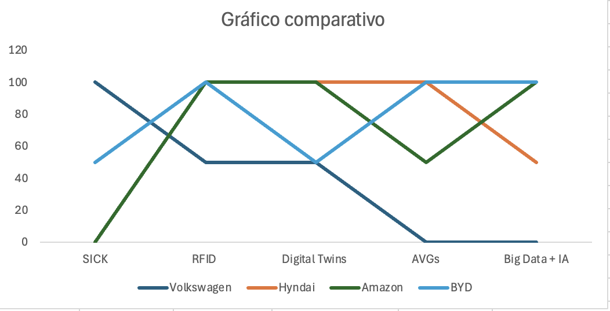

# Benchmarking de IoT na Indústria Automotiva: Estudo de Casos e comparativo com a Volkswagen Brasil

## Objetivo

A VW busca por maneiras de otimizar sua utilização de IoTs em sua linha de montagem, controle de qualidade e uso de dados IoT para eficiência. Para se aprofundar na análise dos processos de IoT que a VW utiliza, foi feito um estudo de casos de sucessos nos processos produtivos em montadoras de referência global, como a Hyundai, Volvo e BYD, a fim de criar um comparativo com as práticas da VW identificando melhores práticas, frameworks e soluções inovadoras que possam ser adaptadas e propostas para a Volkswagen do Brasil.

## 1. Contexto do Projeto

- As soluções a serem apresentadas são fundamentadas pelo uso de IOTs e dashboards de acompanhamento da linha de produção automotiva. Para uma compreenção profunda de como os processos da linha de produção da Volkswagen Brasil podem ser ainda mais eficazes, será analisado como outras gigantes desse setor utilizam diferentes tecnologias para minimizar falhas e atrasos ocasionado por processos pouco otimzados na gestão de dados e monitoramento em tempo real. Qualquer parada na linha de produção pode gerar impactos financeiros significativos e por isso se torna essencial a implementação de soluçõees que possuem um alto grau de eficiência. Além disso serão estudadas diferentes maneiras de gestão de estoque e cadeia de suprimentos, que são pontos críticos para o sucesso da produção automotiva que segue o modelo Just in Time.

- O primeiro passo para uma compreensão profunda dos processos a serem otimizados é mapear o ambiente técnico atual da Volkswagen, que opera sobre uma arquitetura industrial robusta e altamente padronizada.  
  No chão de fábrica, a linha de montagem utiliza sensores críticos, como leitores UHF SICK, sensores de torque HBM, posicionamento Balluff e vibração IFM, integrados a CLPs Siemens S7-1200/1500.

  Os dados coletados percorrem uma rede cabeada TCP/IP industrial, passando por switches gerenciáveis, gateways OT/TI e protocolos como OPC-UA e MQTT, até chegarem à camada de TI.  

  Lá, servidores IBM Power em cluster PowerHA e o banco DB2 processam mais de 50 mil eventos/hora, enquanto o Node-RED atua como orquestrador da telemetria, transformando e roteando eventos para dashboards personalizados utilizados pela operação.  

  Esse ecossistema integrado define o cenário técnico que será analisado para identificar oportunidades de otimização, automação e redução de gargalos.

## 2. Caso(s) de Referência

Estudar casos de sucesso dentro da indústria automotiva global é essencial para identificar práticas inovadoras e tecnologias eficazes que podem ser adaptadas para a Volkswagen Brasil. A seguir, apresentamos três casos de referência que destacam o uso avançado de IoT, automação e gestão de estoque em montadoras líderes mundiais.

### Caso 1: Hyundai Motor Company

A Hyundai Motor Company é um case de sucesso na implementação de IoT em suas linhas de produção. A Hyundai atualmente opera uma das fábricas mais avançadas tecnologicamente no mundo, localizada em Ulsan, Coreia do Sul, a fábrica possui a maior produção anual de veículos, com uma capacidade de produção de 1,6 milhão de unidades por ano. Sua metodologia de produção possui uma série de semelhanças com a Volkswagen, o que a torna um excelente "espelho" para análise e comparação. Ambas as empresas utilizam o modelo Just in Time para gestão de estoque e possuem uma esteira contínua e linear de produção (Ref 1).

#### Como a Hyundai estrutura seu modelo JIT
Cada veículo recebe um Vehicle Identification Number (VIN) com um build sheet digital — uma ficha que contém:

- Modelo e versão (ex.: Tucson GLS 4WD)  
- Cor externa e interna  
- Tipo de motor/transmissão  
- Acessórios opcionais  

Essa ficha é lida automaticamente por sensores RFID em cada estação. Assim, o sistema sabe exatamente quais peças devem ser entregues para aquele veículo, e em qual ordem. (Ref 2)

#### Controle de estoque
- Abastecimento sincronizado: cada estação tem um tempo padrão de ciclo (por exemplo, 55 segundos).  
- Um sistema logístico interno (com AGVs e robôs) entrega os kits de peças exatamente 1–2 minutos antes do uso. (Ref 3 – Plant and Equipment News)  
- Esse processo é chamado de milk run interno: pequenos veículos elétricos circulam levando peças para cada célula no momento ideal.  
- Fornecedores locais (raio de 10 km) recebem pedidos em tempo real via EDI.

Quando a Hyundai produz um carro vermelho, o fornecedor já sabe que o próximo painel, banco e faróis serão vermelhos e envia exatamente aquele conjunto para a doca certa, em sequência. Essa operação elimina estoque intermediário.

#### Mudanças de processo e resultados
A digitalização da Hyundai transformou profundamente o funcionamento da linha de produção em Ulsan. O que antes dependia de leitura manual de build sheets e abastecimento baseado em previsão passou a operar com identificação automática via RFID, kits de peças entregues por AGVs sincronizados ao ciclo de produção e abastecimento guiado por dados emitidos em tempo real por cada estação. Esse fluxo contínuo é responsável  pela intensa rastreabilidade do sistema, deste modo, com precisão de segundos, é possível saber qual peça será consumida em seguida, eliminando estoques intermediários. Além disso, a integração entre sensores, AGVs, fornecedores locais e o modelo JIT cria um ambiente onde rupturas são detectadas antecipadamente, e o abastecimento pode ser ajustado antes que ocorra uma parada. Essa automação logística combinada ao monitoramento digital do VIN e ao controle sequencial do build sheet diminui a quantidade de erros humanos e tempo de ciclo. Tudo isso contribui para aumentar a estabilidade da linha ao garantir que cada estação receba o componente certo exatamente no momento certo.

### Caso 2: Amazon

A Amazon é considerada uma das maiores referências globais em operações logísticas e gestão de estoque baseadas em IoT, automação e dados em tempo real. Seus centros de fulfillment utilizam um ecossistema avançado composto por sensores IoT, RFID, robôs móveis, WMS e algoritmos de previsão para rastrear, movimentar e reposicionar itens com altíssima precisão. (Ref 5)

#### Tecnologias utilizadas
 
- Sensores IoT  
- RFID  
- Rastreamento de estoque em tempo real  
- WMS  
- Robôs móveis (Kiva robots)
- AWS Simulation and Digital Twin para otimização de layout e fluxo  
- Sistemas de slotting inteligente (alocação dinâmica de itens)  
- Robôs que movimentam racks  
- Sistemas de picking automatizados  
(Ref 5)

#### Mudanças de processo e resultados

- O processo manual de localização, movimentação e separação de itens foi substituído (ou altamente assistido) por sistemas automatizados que conseguem saber em que estante, em que prateleira, item está, praticamente em tempo real. (Ref 6)
- Monitoramento de estoque “live” possibilita decisões imediatas para reposição, redistribuição de itens, melhor alocação de recursos humanos e máquinas. Por exemplo: “o tracking em tempo real garante que os dados de inventário estão sempre atualizados com mais de 99% de acurácia” no estudo. (Ref 6)
- Dados históricos + inteligência permitem prever demanda, agrupar pedidos, planejamento de picking mais eficiente, reduzindo retrabalho, tempo ocioso, erros de picking. 

### Caso 3: BYD

A BYD utiliza um conjunto de tecnologias IoT integradas para aumentar a eficiência operacional em suas fábricas. Sensores distribuídos monitoram em tempo real o fluxo de materiais, o estado de máquinas e o consumo de componentes.

#### Tecnologias utilizadas

- Conectividade industrial de alta velocidade: A BYD trabalhou com Huawei para construir redes de alta capacidade (10 Gbps, núcleos 100 G, APs WiFi industrial para IoT) em seu campus de produção.
- AGVs e sistemas automatizados para transporte  
- Modelos de previsão baseados em histórico de consumo:   
- Dashboards integrados com visão em tempo quase real
- Big Data e IA para análise preditiva: Em estudos, a BYD é citada como empresa que usa big data + IA para “orquestrar recursos” na cadeia de suprimentos, reorganizar fornecedores, prever demandas, integrar produção e logística.
- Rede de processos integrados e verticalização: A BYD controla grande parte da cadeia (baterias, motores, componentes), o que combinado com os sistemas digitais reduz dependência de fornecedores externos e melhora o controle de estoque e fluxo.

#### Mudanças de processo e resultados

Com sensores, conectividade e dashboards, a BYD transformou operações que antes eram manuais ou reativas em operações com visibilidade imediata e capacidade de intervenção proativa. Por exemplo, redução de chamadas de manutenção manual, menos falhas de rede/O&M: O case Huawei/BYD cita redução de 60% em reclamações de rede e melhora de 48% eficiência de O&M. Esse tipo de operação ajuda a  detectar falhas e gargalos por falta de peças antes que causem parada de linha ou atraso. (Ref 7)

### 2.1. Comparação de Tecnologias IoT Utilizadas por cada empresa 

Para avaliar as tecnoligas IoTs utiliziadas em cada um dos casos de referência, foi elabarado um gráfico comparativo que enfatiza padrões tecnológicos e níveis de maturidade em IoT entre as empresas analisadas. Isso ajuda a identificar quais tecnologias são mais eficazes e como elas se alinham com as melhores práticas do setor.

  Gráfico comparativo - tecnologias IoT 

  Fonte: do próprio grupo

O gráfico revela níveis distintos de maturidade tecnológica entre as empresas analisadas. A Volkswagen mostra forte dependência de sensores ópticos SICK e adoção parcial de RFID, Digital Twins e AGVs, indicando uma arquitetura ainda mais tradicional e menos centrada em dados. Em contraste, Hyundai, Amazon e BYD apresentam padrões tecnológicos muito mais avançados, com uso intenso de RFID, AGVs, Digital Twins e Big Data + IA. A similaridade entre Hyundai e Amazon é especialmente relevante: embora atuem em setores completamente diferentes — automotivo e logística — ambas convergem para o mesmo conjunto de tecnologias de alta eficiência, com forte integração de automação, rastreamento inteligente e análise preditiva. Isso explica como a Hyundai mantém a maior capacidade produtiva de veículos do mundo e como a Amazon atinge níveis extremos de precisão e velocidade logística, evidenciando que a combinação dessas tecnologias é um fator crítico de excelência operacional em qualquer indústria.

## 3. KPIs 

### 3.1. Seleção de KPIs

Para avaliar de forma objetiva a eficiência da cadeia de abastecimento e sua aderência às práticas de Indústria 4.0, selecionamos KPIs amplamente reconhecidos. Esses indicadores permitem comparar o desempenho da operação com referências de mercado.

A escolha desses KPIs está diretamente ligada aos objetivos da solução proposta: visibilidade de consumo, previsões e alertas proativos. Eles medem disponibilidade de peças, estabilidade da linha, eficiência do uso de estoque e redução de falhas.

### 3.2. O que é cada KPI

#### Giro de estoque (Inventory Turnover)
- Mede quantas vezes o estoque é renovado dentro de um período.  
- Indica eficiência da movimentação de peças.  
- Valores mais altos representam menor estoque parado.

#### Disponibilidade de peças (%)
- Avalia se as peças necessárias estão disponíveis no momento certo.  
- Alta disponibilidade reduz risco de parada e melhora fluidez.  
- Operações JIT/JIS exigem níveis próximos de 100%.

#### Recall Rate (%)
- Mede a porcentagem de peças ou conjuntos montados que apresentam defeitos e levam a ações corretivas.  
- Está associado à qualidade, rastreabilidade e controle de montagem.  
- Reduções nesse indicador representam menor retrabalho e menores custos de garantia.

#### Tempo médio de inatividade (%)
- Representa o percentual do tempo produtivo perdido por falhas, falta de peças, atrasos ou problemas de máquina.  
- Impacta diretamente a produtividade e o custo por unidade produzida.  
- Reduzir a inatividade é um dos maiores fatores de ganho operacional em manufatura.

### 3.3. Tabela de KPIs — Gestão da Cadeia de Abastecimento

| **KPI** | **Expressão** | **Benchmark da indústria** | **Ganhos do projeto** |
|--------|-----------------------------------------|-------------------------|--------------------------------------|
| **Giro de estoque (Inventory Turnover)** | $$\text{Giro de Estoque} = \frac{\text{Custo dos veículos vendidos}}{\text{Valor médio do estoque}}$$ | Média de 3 a 4 giros de estoque no ano. Boas práticas recomendam entre 6–12 giros/ano para operação enxuta, evitando tanto excesso quanto falta de estoque. | O painel IoT permite acompanhar consumo em tempo quase real e projetar demanda com base no histórico, viabilizando ajuste fino de estoque mínimo seguro. elevando o giro sem causar prejuízo. |
| **Disponibilidade de peças (%)** | $$\text{Disponibilidade} = \left( \frac{\text{Peças disponíveis}}{\text{Total de peças}} \right) \times 100$$ | Metas acima de 95%, e benchmarks de manufatura apontam 98%+ como referência de excelência para atendimento imediato a partir de estoque. | O dashboard centralizado, aumenta a visibilidade de risco de ruptura. Isso permite redução de stockouts e aproximação da disponibilidade de peças dos níveis de 95–98% esperados em ambientes JIT/JIS. |
| **Recall Rate (%)** | $$\text{Taxa\ de\ Recall} = \left( \frac{\text{Peças defeituosas}}{\text{Total de peças produzidas}} \right) \times 100$$ | Índice de recalls elevados, com veículos ao longo da vida útil podendo acumular múltiplas campanhas de recall e fabricantes emitindo dezenas de ações por ano. | Solução aumenta qualidade na estação monitorada: análise estatística do histórico e identificação de anomalias ajudam a encontrar causas-raiz de defeitos mais cedo, diminuindo a taxa de recall associada às peças e processos cobertos pelo painel. |
| **Tempo médio de inatividade (%)** | $$\text{Inatividade} = \left( \frac{\text{Tempo de inatividade}}{\text{Tempo total de produção}} \right) \times 100$$ | Taxas de perda de 5% a 20% da produtividade por inatividade. Na indústria automotiva, o custo pode chegar a dezenas de milhares de dólares por minuto, tornando o downtime um dos fatores mais críticos de custo. | Com observabilidade em tempo real do consumo, a planta passa de um modelo reativo para um modelo preditivo. Isso reduz paradas por falta de peças e, consequentemente, diminui o tempo de inatividade relativo e o custo associado por hora parada. |

### 4. Lições Aprendidas e Melhorias
A análise dos casos evidencia que operações industrialmente maduras adotam um conjunto de princípios comuns: visibilidade contínua, rastreabilidade precisa, automação logística e uso intensivo de dados históricos para prever consumo e antecipar falhas. Essas práticas se mostraram aplicáveis ao contexto da Volkswagen, especialmente considerando a arquitetura já existente de telemetria baseada em sensores SICK, Keyence e CLPs Siemens.

#### 4.1. Lições aprendidas:
- **A rastreabilidade granular do consumo reduz rupturas e aumenta estabilidade**
Hyundai e BYD demonstram que saber exatamente “qual peça será consumida em seguida”  via RFID, sensores sincronizados e build sheets digitais permite eliminar estoques intermediários e prever faltas com antecedência.
- **Automação logística e abastecimento sincronizado aumentam a eficiência da linha**
AGVs, milk run interno e kits entregues em ritmo de ciclo reduzem tempo ocioso e minimizam dependência de operadores, replicando práticas adotadas por Hyundai e Amazon.
- **Dados em tempo real + análise histórica permitem transição de reativo para preditivo**
Todos os casos mostraram ganhos significativos ao substituir inspeções manuais por dashboards e alertas inteligentes, permitindo decisões rápidas e prevenindo gargalos, representando exatamente o objetivo do MVP proposto.
- **Ambientes com telemetria contínua reduzem erros humanos e retrabalho**
A Amazon e a BYD evidenciam que maior automação de leitura, baixa automática e controles digitais diminui erros, melhora KPIs de qualidade e reduz recalls.
- **Integração entre produção e fornecedores aumenta confiabilidade do JIT**
A operação da Hyundai mostra que JIT só funciona plenamente quando fornecedores recebam eventos em tempo real, o que é uma lição aplicável ao pipeline futuro da VW.

#### 4.2. Possíveis melhorias para a Volkswagen:
Baseado nas lições aprendidas, as seguintes melhorias são recomendadas para a Volkswagen Brasil:
- Ampliar cobertura de sensores RFID para rastreabilidade em nível de peça.
- Adicionar camada de alertas inteligentes (V/A/V) conectada ao comportamento real da esteira.
- Implementar automação logística com AGVs para entrega sincronizada de kits.
- Desenvolver modelos preditivos baseados em histórico de consumo para ajuste dinâmico de estoque.
- Criar um pipeline de baixa no estoque de maneira automática validado por múltiplos sensores. 
- Criar dashboards unificados com visão de consumo, fila e status da estação

### 5. Conclusão 
O benchmark realizado com Hyundai, Amazon e BYD evidencia um padrão claro entre as operações de alta performance. É notável que o domínio sobre dados em tempo real de processo da cadeia de suprimentos é indispensável para que se encontre a maneira ótima para moldar o sistema JIS em uma linha de produção complexa com a da VW. As empresas analisadas demonstram que o avanço em eficiência produtiva depende da capacidade de antecipar gargalos e garantir estabilidade operacional por meio de IoT e análise contínua. Para a Volkswagen, esse estudo oferece direcionamentos concretos sobre como evoluir seu ecossistema atual, revelando lacunas, oportunidades e caminhos tecnológicos alinhados às melhores práticas globais. O projeto proposto , baseado em um painel de observabilidade IoT e alertas inteligentes e análise histórica posiciona a VW para dar um passo decisivo rumo a uma operação mais preditiva, estável e orientada por dados, fortalecendo sua competitividade e criando bases sólidas para uma jornada consistente de Indústria 4.0.

### 6. Referências

Ref 1: https://www.sciencedirect.com/science/article/abs/pii/S027861251730016X

Ref 3:https://www.plantandequipment.news/news/global/hyundai-ces-ulsan-plant-lays-the-groundwork-for-the-global-one-factory/

Ref 4: https://pulse.mk.co.kr/news/english/11322562

Ref 5: https://aws.amazon.com/blogs/supply-chain/aws-simulation-and-digital-twin-to-increase-warehouse-productivity/

Ref 6: https://portalcris.vdu.lt/server/api/core/bitstreams/c70d3c8a-7706-46a8-a2df-8ed57e2f75cc/content

Ref 7: https://e.huawei.com/es/case-studies/solutions/enterprise-network/