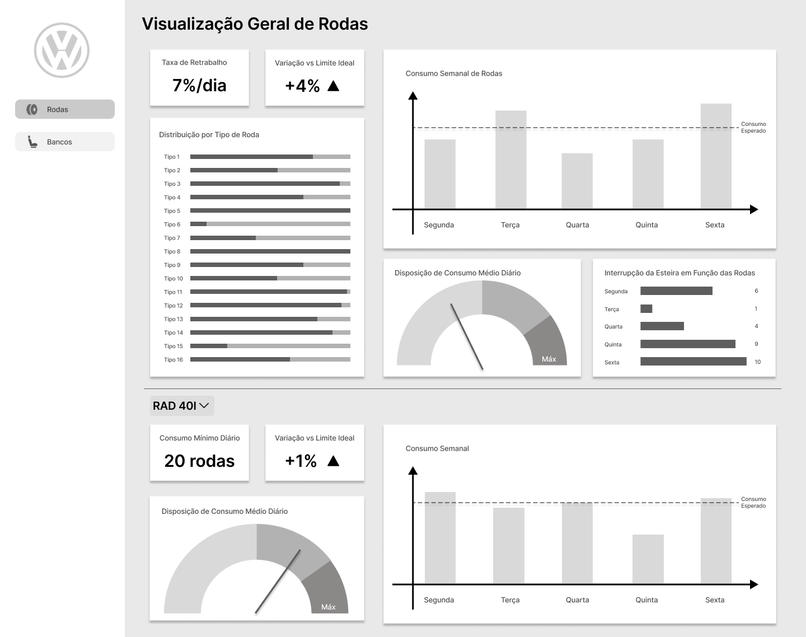
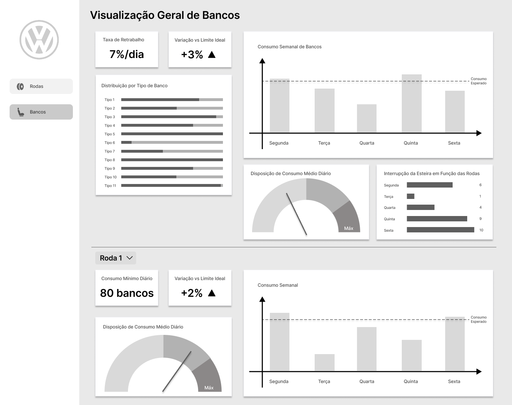

# Wireframe

Figura 01: Wireframe da aba Rodas

Source: Material produzido pelo Time Sem Parar, 2025.

---

Figura 02: Wireframe da aba Banco

Source: Material produzido pelo Time Sem Parar, 2025.

---
 

Os wireframes foram divididos em duas abas na lateral esquerda: Rodas e Bancos. As duas seguem a mesma estrutura, já que o objetivo é o mesmo, a diferença está só nos dados de cada peça. Por isso, para explicar, focamos em apenas uma das abas, já que ambas funcionam da mesma forma. Além disso também separamos cada aba em duas seções.
 

## 1. **Seção Superior: Visão Geral**
Essa parte foi pensada para ser uma visualização rápida e fácil, onde o usuário consegue entender o cenário geral do dia sem precisar clicar em nada. Aqui colocamos:

- **Taxa de retrabalho:** mostra de forma direta a porcentagem de carros que precisaram de retrabalho no dia.

- **Variação vs Limite Ideal:** compara o consumo real com o limite ideal. Se passou, mostramos uma seta vermelha apontando para cima; se ficou dentro do limite, aparece uma seta verde.

- **Distribuição por tipo de roda:** lista os 16 modelos e mostra como está o consumo de cada um em relação ao seu estoque individual.

- **Consumo semanal de rodas:** usamos um gráfico de barras para facilitar a leitura dos dias com maior e menor consumo, junto com uma linha pontilhada do consumo esperado para comparação.

- **Disposição de consumo médio diário:** aqui escolhemos um gráfico em formato de velocímetro, com as cores verde, amarelo e vermelho indicando se o consumo está dentro do aceitável. Esse gráfico ainda pode ser ajustado, já que na última retrospectiva a equipe da Volkswagen comentou que seria melhor trabalhar com mix de carros do que média simples.

- **Interrupções da esteira:** mostra quantas vezes a esteira parou em cada dia da semana por causa de problemas relacionados às rodas.
  

## 2. **Seção Inferior: Visualização Detalhada**

- A parte superior traz um panorama geral, então nesta seção focamos em uma visão mais específica. Aqui o usuário pode escolher qual tipo de roda quer analisar com mais detalhe.
 

- Nessa parte, alguns gráficos se repetem (como variação e consumo semanal), mas agora filtrados pelo modelo selecionado. O único gráfico novo é o de Consumo mínimo diário, calculado com base no histórico passado daquele modelo.
