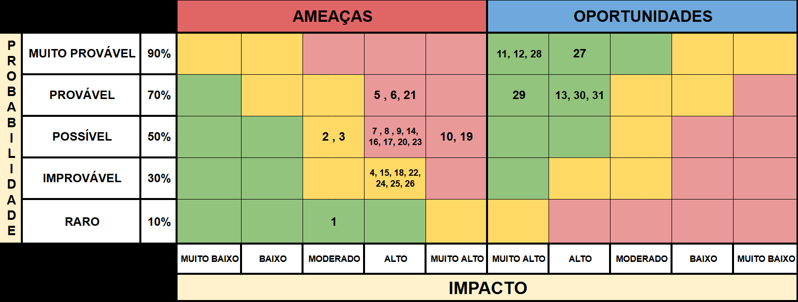

# MATRIZ DE RISCOS (Sprint 4)

## Introdução
A matriz de riscos é uma ferramenta de gestão que permite identificar, avaliar e monitorar os principais eventos que podem impactar o andamento e os resultados de um projeto. Por meio dela, é possível antecipar ameaças, aproveitar oportunidades e planejar ações preventivas e corretivas de forma estruturada.

No contexto deste projeto desenvolvido em parceria com a Volkswagen, a matriz de riscos foi elaborada para garantir maior previsibilidade nas entregas, alinhamento entre equipe e parceiro e controle sobre aspectos técnicos, acadêmicos e operacionais. Cada risco foi avaliado quanto à sua probabilidade e impacto, resultando em planos de mitigação e contingência que asseguram a continuidade e a qualidade do desenvolvimento do MVP.

Na Sprint 4, revisamos os riscos mapeados anteriormente a partir dos aprendizados técnicos e de negócios da sprint, principalmente após a entrega do Dashboard versão 1, da segunda versão da arquitetura IoT, da análise de viabilidade financeira (EVTE) e do checklist de entrega. Com isso, alguns riscos tiveram seus níveis de probabilidade e impacto ajustados, e surgiram novos riscos diretamente ligados à performance do sistema, à viabilidade econômica do projeto, à disponibilidade de componentes no mercado brasileiro, à qualidade das análises financeiras e aos testes de usabilidade do dashboard.

---

## Estrutura da Matriz

- A matriz está dividida em dois grupos principais:

  - **Ameaças:** Eventos/riscos que podem prejudicar ou comprometer o sucesso do projeto.

  - **Oportunidades:** Aspectos que, quando bem explorados, podem gerar benefícios relevantes.

- Cada risco é analisado com base em:

  - **Probabilidade (Raro: 10% | Improvável: 30% | Possível: 50% | Provável: 70% | Muito Provável: 90%):** Chance estimada de o risco se concretizar.

  - **Impacto (Muito Baixo | Baixo | Moderado | Alto | Muito Alto):** Consequência esperada caso o risco se realize.
      

  Matriz de Riscos – Sprint 4 

  Fonte: do próprio grupo

---

## Lista dos Riscos

1. **Diferenças de opinião no grupo**  
   Ameaça: Conflitos internos entre membros da equipe e diversidade de visão – **10% / Moderado**

2. **Análises imprecisas por uso de dados antigos**  
   Ameaça: Limitação das análises por uso de dados antigos – **50% / Moderado**

3. **Sobrecarga de tarefas na equipe**  
   Ameaça: Acúmulo de responsabilidades entre os membros da equipe – **50% / Moderado**

4. **Documentação do projeto desatualizada ou incompleta**  
   Ameaça: Falhas na atualização e versionamento da documentação do projeto – **30% / Alto**

5. **Problemas de integração no ambiente do Inteli**  
   Ameaça: Falha na integração simulada em ambiente acadêmico – **70% / Alto**

6. **Falta de alinhamento com a Volkswagen**  
   Ameaça: Falha de alinhamento entre grupo e Volkswagen sobre o escopo técnico – **70% / Alto**

7. **Expectativas do parceiro acima do possível**  
   Ameaça: Desalinhamento entre viabilidade técnica e expectativas do parceiro – **50% / Alto**

8. **Desalinhamento de prazos entre o Inteli e a Volkswagen**  
   Ameaça: Descompasso entre prazos acadêmicos e ciclos da Volkswagen – **50% / Alto**

9. **Menor envolvimento da Volkswagen ao longo das sprints**  
   Ameaça: Redução de engajamento da Volkswagen em fases intermediárias – **50% / Alto**

10. **Possível desalinhamento entre o MVP e padrões industriais**  
    Ameaça: MVP não reflete indicadores industriais relevantes – **50% / Muito Alto**

11. **Parceiro comprometido com o projeto**  
    Oportunidade: Engajamento ativo do parceiro nas entregas e decisões – **90% / Muito Alto**

12. **Dados históricos reais e relevantes**  
    Oportunidade: Uso de bases reais para melhorar análises e destacar variáveis mais relevantes – **90% / Muito Alto**

13. **Diferentes pontos de vista da equipe**  
    Oportunidade: Diversidade de ideias gerando soluções mais criativas – **70% / Alto**

14. **Definição inadequada de KPIs industriais**  
    Ameaça: Escolha de KPIs que não refletem os indicadores utilizados pela Volkswagen – **50% / Alto**

15. **Falhas na integridade e organização dos dados coletados**  
    Ameaça: Estrutura inadequada do banco de dados, perda de integridade e inconsistências – **30% / Alto**

16. **Interface não aderente às necessidades reais do usuário VW**  
    Ameaça: Dashboard ou interface não útil para supervisores, analistas ou gestores industriais – **50% / Alto**

17. **Performance inadequada do dashboard com grande volume de dados**  
    Ameaça: Dashboard não suporta eficientemente o processamento de 50.000+ eventos/hora – **50% / Alto**

18. **Dashboard não atende às User Stories mapeadas**  
    Ameaça: Funcionalidades implementadas não correspondem aos requisitos das personas e User Stories – **30% / Alto**

19. **Viabilidade financeira não atrativa para a Volkswagen**  
    Ameaça: ROI baixo, payback longo ou VPL negativo comprometem a aprovação do projeto – **50% / Muito Alto**

20. **Custos de implementação acima do orçamento previsto**  
    Ameaça: Custo total de implantação excede as estimativas iniciais, impactando a viabilidade – **50% / Alto**

21. **Componentes IoT indisponíveis no Brasil ou com lead time extenso**  
    Ameaça: Dependência de importação e prazos de 60-180 dias comprometem o cronograma – **70% / Alto**

22. **Falhas na análise de viabilidade financeira**  
    Ameaça: Erros nos cálculos de ROI, VPL, TIR ou payback comprometem a credibilidade da análise – **30% / Alto**

23. **Arquitetura IoT não adaptada ao contexto brasileiro**  
    Ameaça: Solução não considera instabilidade de infraestrutura, burocracia logística e exigências regulatórias locais – **50% / Alto**

24. **Contratos administrativos mal definidos com fornecedores**  
    Ameaça: Falta de clareza em SLAs, responsabilidades e critérios de desempenho gera conflitos operacionais – **30% / Alto**

25. **Testes de usabilidade não representativos do público-alvo**  
    Ameaça: Participantes dos testes não refletem os usuários reais (supervisores, analistas, gestores industriais) – **30% / Alto**

26. **Resultados de usabilidade indicando problemas críticos de interface**  
    Ameaça: Testes de usabilidade revelam problemas graves que comprometem a adoção do dashboard – **30% / Alto**

27. **Engajamento ativo e colaborativo da Volkswagen**  
    Oportunidade: Parceiro participativo, oferecendo feedback rápido e alinhamento contínuo – **90% / Alto**

28. **Uso de dados históricos reais e rastreáveis**  
    Oportunidade: Uso de bases reais permite análises aplicáveis e tomadas de decisão confiáveis – **90% / Muito Alto**

29. **Viabilidade financeira comprovada com indicadores positivos**  
    Oportunidade: ROI atrativo, payback rápido e VPL positivo demonstram valor estratégico do projeto – **70% / Muito Alto**

30. **Arquitetura IoT alinhada às necessidades reais da operação**  
    Oportunidade: Solução adaptada ao contexto brasileiro com componentes disponíveis e suporte local – **70% / Alto**

31. **Testes de usabilidade validando a eficácia do dashboard**  
    Oportunidade: Resultados positivos dos testes comprovam que o dashboard atende às necessidades dos usuários – **70% / Alto**

---

## Explicação dos Riscos

### 1. Diferenças de opinião no grupo  
**AMEAÇA:** Conflitos internos entre membros da equipe e diversidade de visão – **10% / Moderado**  

**Severidade:** Baixo  

Existe uma chance pequena (10%) de surgir conflito na equipe, já que é o primeiro módulo trabalhando juntos. Isso pode gerar diferenças de opinião e de ritmo. Se acontecer, pode dificultar decisões, atrasar entregas e sobrecarregar alguns membros. O efeito tende a ser limitado, mas pode afetar o clima e a produtividade do grupo.

**Sinais de alerta:** divergências frequentes em reuniões, falta de consenso em decisões e desmotivação entre integrantes.  

**Resposta ao risco:** Mitigar  

**Plano de Ação:** Promover reuniões de alinhamento e feedback, incentivar escuta ativa e respeito às ideias individuais. Caso o conflito aconteça, o Scrum Master deve intermediar a situação e redistribuir funções se necessário.  

**Responsável:** Scrum Master  
**Prazo:** Contínuo  

---

### 2. Análises imprecisas por uso de dados antigos  
**AMEAÇA:** Limitação das análises por uso de dados antigos – **50% / Moderado**  

**Severidade:** Moderada  

O risco de as análises ficarem parcialmente defasadas foi avaliado com probabilidade moderada (50%) e impacto também moderado. Isso ocorre porque os dados utilizados, apesar de reais, são de períodos anteriores, o que pode gerar resultados que não representam totalmente o cenário atual da Volkswagen. Caso o risco ocorra, as conclusões podem não refletir o contexto produtivo mais recente, afetando a precisão das análises e a aplicabilidade do MVP.

**Sinais de alerta:** divergência entre valores esperados e reais, padrões pouco condizentes com operações atuais e limitações identificadas na comparação de períodos.  

**Resposta ao risco:** Mitigar  

**Plano de Ação:** Indicar claramente o período dos dados utilizados, contextualizar as possíveis limitações no relatório e, se possível, complementar as análises com comparações ou estimativas baseadas em dados públicos mais recentes.  

**Responsável:** Equipe de Dados  
**Prazo:** Contínuo  

---

### 3. Sobrecarga de tarefas na equipe  
**AMEAÇA:** Acúmulo de responsabilidades entre os membros da equipe – **50% / Moderado**  

**Severidade:** Moderada  

O risco de sobrecarga de tarefas entre os membros da equipe foi avaliado com probabilidade moderada (50%) e impacto também moderado. Isso pode acontecer porque em algumas sprints o trabalho acaba concentrado em poucas pessoas (funções específicas, prazos curtos). Se acontecer, a produtividade cai, erros aumentam e a motivação diminui, afetando o ritmo e a qualidade geral do projeto.

**Sinais de alerta:** acúmulo de tarefas em um mesmo membro, atrasos repetidos em entregas e dificuldade de acompanhar várias frentes.  

**Resposta ao risco:** Mitigar  

**Plano de Ação:** Definir claramente os papéis de cada membro no início de cada sprint e revisar periodicamente a carga de trabalho. Se houver desequilíbrio, redistribuir tarefas e apoiar quem estiver sobrecarregado.  

**Responsável:** Scrum Master  
**Prazo:** Contínuo  

---

### 4. Documentação do projeto desatualizada ou incompleta  
**AMEAÇA:** Falhas na atualização e no versionamento da documentação do projeto – **30% / Alto**  

**Severidade:** Moderada  

O risco de a documentação do projeto ficar desatualizada ou incompleta foi avaliado com probabilidade de 30% e impacto alto. Isso pode ocorrer por conta do ritmo do projeto e das mudanças ao longo das sprints. Se acontecer, informações importantes podem se perder e a inconsistência entre o que foi documentado e o que foi implementado pode gerar dúvidas nas revisões e nas apresentações finais.

**Sinais de alerta:** falta de registro de mudanças, divergência entre o código e a documentação e ausência de histórico atualizado nas versões.  

**Resposta ao risco:** Mitigar  

**Plano de Ação:** Atualizar os principais documentos ao fim de cada sprint, manter histórico de versões e registrar mudanças no repositório. Em caso de divergências, revisar em grupo e unificar as informações antes do fim da sprint.  

**Responsável:** Equipe de Documentação  
**Prazo:** Contínuo  

---

### 5. Problemas de integração no ambiente do Inteli  
**AMEAÇA:** Falha na integração simulada em ambiente acadêmico – **70% / Alto**  

**Severidade:** Alta  

Há uma probabilidade alta (70%) de ocorrerem falhas técnicas devido às limitações de rede e infraestrutura do ambiente acadêmico do Inteli. Como a Volkswagen não pode disponibilizar dados em tempo real, as informações chegam de forma indireta e, às vezes, com defasagens. Isso pode gerar erros tanto na integração entre sensores e o Node-RED quanto na manipulação dos dados durante os testes. Se isso acontecer, o time pode perder tempo tentando resolver falhas de conexão ou inconsistências, atrasando o cronograma e reduzindo a eficiência das entregas.

**Sinais de alerta:** erros de autenticação, falhas de rede, lentidão no servidor ou desconexões frequentes.  

**Resposta ao risco:** Mitigar  

**Plano de Ação:** Montar ambiente de teste local antes da integração principal e modularizar o sistema. Se os problemas persistirem, registrar os erros e propor melhorias para integrações futuras.  

**Responsável:** Equipe Técnica  
**Prazo:** Contínuo  

---

### 6. Falta de alinhamento com a Volkswagen  
**AMEAÇA:** Falha de alinhamento entre grupo e Volkswagen sobre o escopo técnico – **70% / Alto**  

**Severidade:** Alta  

Há uma chance alta (70%) de acontecer desalinhamento entre a equipe e a Volkswagen, já que o parceiro nem sempre tem total clareza sobre o que faz parte ou não do escopo do projeto. Às vezes, são pedidos ajustes ou entregas que fogem do combinado inicial, o que pode gerar confusão e retrabalho. Se isso acontecer, o grupo pode acabar desenvolvendo partes do MVP fora do foco esperado, atrasando o cronograma e afetando a confiança do parceiro.

**Sinais de alerta:** feedbacks repetidos pedindo correção de direção, dúvidas recorrentes sobre as prioridades do backlog e solicitações de replanejamento vindas do parceiro.  

**Resposta ao risco:** Mitigar  

**Plano de Ação:** Usar as reuniões quinzenais com a Volkswagen como principal momento de alinhamento. Registrar as decisões tomadas, atualizar o backlog com as mudanças e revisar o escopo técnico a cada encontro. Se ainda houver divergências, o Scrum Master deve reforçar a comunicação com o parceiro e, com apoio do professor, redefinir as prioridades de entrega.  

**Responsável:** Scrum Master  
**Prazo:** Contínuo  

---

### 7. Expectativas do parceiro acima do possível  
**AMEAÇA:** Desalinhamento entre viabilidade técnica e expectativas do parceiro – **50% / Alto**  

**Severidade:** Alta  

Esse risco é provável (50%) e tem impacto alto, pois ocorre quando o parceiro espera resultados além do que é tecnicamente ou academicamente possível. A diferença de visão entre empresa e academia pode causar retrabalho, frustração e abalar a confiança. Mesmo pequenas divergências sobre escopo ou prazos afetam a percepção de valor do projeto e a motivação da equipe.

**Sinais de alerta:** pedidos fora do escopo, novas demandas sem registro e comentários mostrando diferença entre o esperado e o entregue.  

**Resposta ao risco:** Mitigar  

**Plano de Ação:** Nas reuniões quinzenais, revisar o escopo e alinhar os próximos passos com o parceiro para garantir clareza sobre o que será entregue. Se surgirem novas demandas, registrar as mudanças, explicar os impactos e limitações de forma objetiva e sugerir alternativas que mantenham o cronograma e os objetivos do projeto.  

**Responsável:** Todos  
**Prazo:** Contínuo  

---

### 8. Desalinhamento de prazos entre o Inteli e a Volkswagen  
**AMEAÇA:** Descompasso entre prazos acadêmicos e ciclos da Volkswagen – **50% / Alto**  

**Severidade:** Alta  

Há 50% de chance de descompasso entre o ritmo acadêmico (sprints curtas) e o calendário da VW (ciclos mais longos). Enquanto as sprints seguem prazos curtos e fixos, o parceiro tem ciclos de trabalho mais longos, o que pode atrasar retornos e validações importantes. Isso impacta diretamente o andamento das entregas e pode gerar acúmulo de tarefas ou retrabalho nas fases seguintes.

**Sinais de alerta:** demora nas respostas do parceiro, feedbacks recebidos apenas após o fechamento da sprint e dificuldade para ajustar entregas dentro do prazo.  

**Resposta ao risco:** Mitigar  

**Plano de Ação:** Estruturar as entregas de modo que dependam o mínimo possível de validações externas e revisar prioridades ao início de cada sprint. Caso ocorram atrasos nos retornos, documentar o progresso e seguir com as etapas técnicas internas até o próximo ponto de contato com a VW.  

**Responsável:** Scrum Master  
**Prazo:** Contínuo  

---

### 9. Menor envolvimento da Volkswagen ao longo das sprints  
**AMEAÇA:** Redução de engajamento da Volkswagen em fases intermediárias – **50% / Alto**  

**Severidade:** Alta  

Esse risco tem probabilidade moderada (50%) e impacto alto, pois pode ocorrer uma redução da participação da Volkswagen nas etapas intermediárias do projeto. Isso pode acontecer por limitações de tempo, mudanças de prioridade interna ou períodos de fechamento operacional. A redução de engajamento afeta diretamente o ritmo das entregas, já que o grupo depende do retorno técnico e da validação do parceiro para ajustar o escopo e manter o alinhamento.

**Sinais de alerta:** ausência de retorno a e-mails e mensagens, feedbacks curtos ou genéricos, demora para comentar entregas.  

**Resposta ao risco:** Mitigar  

**Plano de Ação:** Enviar relatórios quinzenais com resumo das entregas e próximos passos. Se o contato diminuir, registrar o progresso e retomar o alinhamento no próximo encontro com o parceiro.  

**Responsável:** Scrum Master  
**Prazo:** Contínuo  

---

### 10. Possível desalinhamento entre o MVP e padrões industriais  
**AMEAÇA:** MVP não reflete indicadores industriais relevantes – **50% / Muito Alto**  

**Severidade:** Alto  

Esse risco é provável (50%) e tem impacto muito alto: se o MVP não estiver alinhado aos indicadores que a Volkswagen realmente utiliza, o parceiro pode considerar o produto pouco aplicável. Isso compromete o valor estratégico da entrega e reduz a credibilidade do grupo. Mesmo funcionando, pode parecer "fora da realidade" se não seguir as métricas do dia a dia da fábrica.

**Sinais de alerta:** feedbacks indicando falta de conexão com a operação real, inconsistência entre os KPIs do painel e os relatórios industriais, dúvidas do parceiro sobre a utilidade prática da solução.  

**Resposta ao risco:** Mitigar  

**Plano de Ação:** Validar indicadores com o parceiro ao fim de cada sprint e ajustar o painel conforme o feedback recebido. Se algum KPI não puder ser aplicado, justificar tecnicamente e sugerir alternativas compatíveis.  

**Responsável:** Equipe Técnica  
**Prazo:** Contínuo  

---

### 11. Parceiro comprometido com o projeto  
**OPORTUNIDADE:** Engajamento ativo do parceiro nas entregas e decisões – **90% / Muito Alto**  

**Severidade:** Alto  

O parceiro demonstra alto comprometimento com o projeto, mantendo interesse e participação ativa nas entregas e decisões. Esse engajamento aumenta a qualidade das validações e acelera o processo de correção e melhoria contínua.

**Sinais:** presença nas reuniões, feedbacks consistentes e comunicação proativa.  

**Resposta:** Explorar  

**Plano de Ação:** Manter comunicação clara e constante com o parceiro, aproveitando os feedbacks recebidos para aprimorar o projeto e solucionar problemas rapidamente.  

**Responsável:** Scrum Master  
**Prazo:** Contínuo  

---

### 12. Dados históricos reais e relevantes  
**OPORTUNIDADE:** Uso de bases reais para melhorar análises e destacar variáveis mais relevantes – **90% / Muito Alto**  

**Severidade:** Alto  

Os dados reais fornecidos pelo parceiro permitem que as análises representem melhor o funcionamento da operação. Isso torna os resultados e modelos mais confiáveis e aplicáveis à realidade da empresa, garantindo que as conclusões tenham valor prático para tomada de decisão.

**Sinais:** dados disponíveis, variáveis-chave identificáveis e qualidade adequada.  

**Resposta:** Explorar  

**Plano de Ação:** Explorar os dados desde o início do projeto, identificar variáveis-chave e usá-las nas análises e modelos, garantindo documentação e sigilo adequados.  

**Responsável:** Equipe de Dados  
**Prazo:** Contínuo  

---

### 13. Diferentes pontos de vista da equipe  
**OPORTUNIDADE:** Diversidade de ideias gerando soluções mais criativas – **70% / Alto**  

**Severidade:** Alto  

A diversidade de perfis e pontos de vista do grupo é uma força importante. Ideias diferentes trazem olhares novos e ajudam a encontrar soluções mais criativas para os desafios. Essa troca fortalece tanto o crescimento pessoal quanto o trabalho em equipe.

**Sinais:** discussões produtivas e variedade de sugestões em reuniões.  

**Resposta:** Explorar  

**Plano de Ação:** Incentivar um ambiente de troca de ideias, realizar reuniões periódicas de alinhamento e transformar divergências em aprendizado coletivo e inovação prática.  

**Responsável:** Scrum Master  
**Prazo:** Contínuo  

---

### 14. Definição inadequada de KPIs industriais  
**AMEAÇA:** Escolha de KPIs que não refletem os indicadores utilizados pela Volkswagen – **50% / Alto**  

**Severidade:** Alta  

Se os indicadores definidos não representarem os usados na operação real, o MVP pode parecer funcional, mas não aplicável ao contexto industrial. Isso prejudica a credibilidade da solução e reduz o valor prático do painel para a VW.

**Sinais de alerta:** feedback do parceiro indicando baixa relevância dos indicadores, questionamentos sobre utilidade dos dados e divergência entre painel e métricas reais da VW.  

**Resposta:** Mitigar  

**Plano de Ação:** Validar continuamente os KPIs com o parceiro, justificar tecnicamente as escolhas e buscar aderência com métricas industriais reais (como OEE, MTBF, lead time, tempo de parada, etc.).  

**Responsável:** Equipe Técnica  
**Prazo:** Contínuo  

---

### 15. Falhas na integridade e organização dos dados coletados  
**AMEAÇA:** Estrutura inadequada do banco de dados, perda de integridade e inconsistências – **30% / Alto**  

**Severidade:** Alta  

Se os dados coletados não forem armazenados com chaves corretas, relações funcionais e rastreabilidade, a credibilidade dos modelos, dashboards e análise de KPIs fica comprometida. Isso dificulta entender o comportamento real da linha e reduz confiança nos resultados.

**Sinais de alerta:** duplicação de registros, falhas na normalização, dificuldade de relacionar tabelas, erros de inserção.  

**Resposta:** Mitigar  

**Plano de Ação:** Validar o modelo relacional antes da implementação, aplicar boas práticas de normalização, documentar o schema e testar integridade na ingestão e organização dos dados.  

**Responsável:** Equipe de Dados  
**Prazo:** Contínuo  

---

### 16. Interface não aderente às necessidades reais do usuário VW  
**AMEAÇA:** Dashboard ou interface não útil para supervisores, analistas ou gestores industriais – **50% / Alto**  

**Severidade:** Alta  

Se o dashboard for construído sem considerar os fluxos reais do usuário industrial, ele pode ser tecnicamente correto, mas pouco útil na operação. Isso prejudica a adoção do MVP e reduz seu impacto no dia a dia da fábrica.

**Sinais de alerta:** feedback apontando confusão visual, excesso ou falta de métricas essenciais, dificuldade de navegação ou leitura.  

**Resposta:** Mitigar  

**Plano de Ação:** Validar wireframes com base nas User Stories e nas rotinas reais da fábrica, apresentar protótipos em reuniões com a VW e ajustar o painel com base nos retornos recebidos.  

**Responsável:** Equipe de UX  
**Prazo:** Contínuo  

---

### 17. Performance inadequada do dashboard com grande volume de dados  
**AMEAÇA:** Dashboard não suporta eficientemente o processamento de 50.000+ eventos/hora – **50% / Alto**  

**Severidade:** Alta  

O dashboard precisa processar e exibir dados em tempo real de um volume significativo de eventos (50.000+ eventos/hora). Se a arquitetura não for otimizada para esse volume, pode haver lentidão, travamentos ou perda de dados, comprometendo a usabilidade e a confiabilidade do sistema. Isso é crítico em um ambiente industrial onde decisões precisam ser tomadas rapidamente.

**Sinais de alerta:** lentidão na atualização de gráficos, timeouts frequentes, consumo excessivo de memória, erros de processamento com grandes volumes de dados.  

**Resposta:** Mitigar  

**Plano de Ação:** Implementar paginação, cache inteligente e otimização de queries. Realizar testes de carga com volumes reais de dados e ajustar a arquitetura conforme necessário. Considerar técnicas de agregação de dados e atualização incremental.  

**Responsável:** Equipe Técnica  
**Prazo:** Contínuo  

---

### 18. Dashboard não atende às User Stories mapeadas  
**AMEAÇA:** Funcionalidades implementadas não correspondem aos requisitos das personas e User Stories – **30% / Alto**  

**Severidade:** Alta  

Se o dashboard não implementar as funcionalidades definidas nas User Stories (como monitoramento de consumo diário, alertas automáticos, relatórios rápidos, visão macro do estoque), ele pode não atender às necessidades reais dos usuários finais. Isso compromete a validação do MVP e reduz seu valor prático.

**Sinais de alerta:** feedback indicando ausência de funcionalidades esperadas, dificuldade em realizar tarefas mapeadas nas User Stories, divergência entre wireframes e implementação sem justificativa.  

**Resposta:** Mitigar  

**Plano de Ação:** Revisar continuamente as User Stories durante o desenvolvimento, validar cada funcionalidade implementada contra os critérios de aceite e documentar justificativas para eventuais mudanças em relação aos wireframes originais.  

**Responsável:** Equipe de UX / Product Owner  
**Prazo:** Contínuo  

---

### 19. Viabilidade financeira não atrativa para a Volkswagen  
**AMEAÇA:** ROI baixo, payback longo ou VPL negativo comprometem a aprovação do projeto – **50% / Muito Alto**  

**Severidade:** Muito Alta  

Se a análise de viabilidade financeira demonstrar ROI baixo, payback superior a 1 mês ou VPL negativo, a Volkswagen pode considerar o projeto não viável economicamente. Isso compromete a aprovação para implementação real e reduz o impacto estratégico do trabalho desenvolvido. A viabilidade financeira é um critério decisivo para projetos industriais de grande porte. **Nota:** Com base na análise atual, o projeto apresenta ROI anual de 1.846% e payback de 18 dias (0,05 anos), indicadores extremamente positivos.

**Sinais de alerta:** ROI abaixo de 100%, payback superior a 1 mês, VPL negativo com TMA entre 10,8% e 13,9%, questionamentos do parceiro sobre retorno do investimento.  

**Resposta:** Mitigar  

**Plano de Ação:** Realizar análise financeira rigorosa com cotações reais de mercado, considerar diferentes cenários (otimista, base, conservador), validar premissas com o parceiro e buscar otimizações que melhorem os indicadores financeiros sem comprometer a qualidade técnica.  

**Responsável:** Equipe de Negócios / Product Owner  
**Prazo:** Contínuo  

---

### 20. Custos de implementação acima do orçamento previsto  
**AMEAÇA:** Custo total de implantação excede as estimativas iniciais, impactando a viabilidade – **50% / Alto**  

**Severidade:** Alta  

Os custos de implementação incluem componentes de hardware (sensores, CLPs, servidores), software (licenças), infraestrutura (rede, cabeamento) e serviços (instalação, integração). Se esses custos ultrapassarem significativamente o orçamento inicial, a viabilidade financeira do projeto fica comprometida. A dependência de componentes importados e a alta carga tributária (45%) aumentam esse risco. **Nota:** Além dos custos diretos, o projeto apresenta impacto no capital de giro devido à antecipação de tributos: R$ 1.380.000 (45% do CAPEX) imobilizado por 3-6 meses antes da operação, resultando em custo de oportunidade de **R$ 124.200** (considerando taxa de juros de 1,5% ao mês por 6 meses: R$ 1.380.000 × 0,015 × 6 = R$ 124.200).

**Sinais de alerta:** cotações acima das estimativas iniciais, variação cambial impactando custos, necessidade de componentes adicionais não previstos, custos de importação e logística superiores ao esperado.  

**Resposta:** Mitigar  

**Plano de Ação:** Obter cotações reais de múltiplos fornecedores, considerar variação cambial nas estimativas, buscar alternativas nacionais quando possível, negociar descontos por volume e documentar todas as premissas de custo utilizadas na análise.  

**Responsável:** Equipe de Negócios  
**Prazo:** Contínuo  

---

### 21. Componentes IoT indisponíveis no Brasil ou com lead time extenso  
**AMEAÇA:** Dependência de importação e prazos de 60-180 dias comprometem o cronograma – **70% / Alto**  

**Severidade:** Alta  

A arquitetura IoT depende de componentes específicos (Siemens S7-1500/1200, sensores HBM, servidores IBM Power) que podem não estar disponíveis no mercado brasileiro ou ter lead times extensos (60-180 dias para componentes críticos como HBM e IBM). **Nota:** A arquitetura refinada identificou que 60% do volume de sensores (Balluff, IFM, Atlas Copco) possui estoque local no Brasil, com lead times reduzidos de 7-45 dias, mitigando parcialmente esse risco. No entanto, componentes críticos como sensores HBM (90-120 dias) e servidores IBM (90-180 dias) ainda dependem de importação direta. Isso pode atrasar significativamente a implementação e comprometer prazos acadêmicos. A burocracia aduaneira e a necessidade de certificações também aumentam esse risco.

**Sinais de alerta:** falta de estoque local, prazos de entrega superiores a 90 dias, necessidade de importação direta, exigências de certificações não previstas, bloqueios aduaneiros.  

**Resposta:** Mitigar  

**Plano de Ação:** Identificar alternativas com disponibilidade local (já identificados: Balluff, IFM, Atlas Copco representam 60% do volume), estabelecer parcerias com distribuidores autorizados (Siemens, SICK possuem distribuidores no Brasil), considerar componentes equivalentes certificados, planejar estoque de segurança (2 unidades para HBM) e documentar lead times realistas na arquitetura refinada (7-45 dias para componentes locais, 90-180 dias para importação direta).  

**Responsável:** Equipe Técnica  
**Prazo:** Contínuo  

---

### 22. Falhas na análise de viabilidade financeira  
**AMEAÇA:** Erros nos cálculos de ROI, VPL, TIR ou payback comprometem a credibilidade da análise – **30% / Alto**  

**Severidade:** Alta  

Se houver erros nos cálculos financeiros (ROI, VPL, TIR, payback), premissas incorretas ou interpretações inadequadas dos resultados, a análise de viabilidade perde credibilidade. Isso pode levar a decisões equivocadas e comprometer a confiança do parceiro na qualidade do trabalho desenvolvido. **Nota:** É crítico garantir consistência entre todos os documentos do projeto. Os valores corretos validados são: CAPEX de R$ 3.067.479, benefícios anuais de R$ 56.625.000, ROI anual de **1.846%** (calculado como: (56.625.000 / 3.067.479) × 100 = 1.846%) e payback de 18 dias (0,05 anos). Qualquer inconsistência entre documentos (como valores diferentes de ROI) deve ser identificada e corrigida imediatamente.

**Sinais de alerta:** inconsistências nos cálculos, valores fora do esperado, falta de justificativa para premissas, erros nas fórmulas financeiras, interpretações incorretas dos indicadores, **discrepâncias entre valores reportados em diferentes documentos do projeto**.  

**Resposta:** Mitigar  

**Plano de Ação:** Validar todos os cálculos com múltiplas fontes, revisar fórmulas financeiras, documentar premissas e metodologias, realizar revisão por pares e apresentar os resultados de forma clara e transparente. **Ação crítica:** Realizar auditoria cruzada entre todos os documentos do projeto (arquitetura, matriz de riscos, EVTE, BOM) para garantir que todos os valores financeiros (ROI, payback, CAPEX, benefícios) estejam consistentes e corretos em todos os documentos.  

**Responsável:** Equipe de Negócios  
**Prazo:** Contínuo  

---

### 23. Arquitetura IoT não adaptada ao contexto brasileiro  
**AMEAÇA:** Solução não considera instabilidade de infraestrutura, burocracia logística e exigências regulatórias locais – **50% / Alto**  

**Severidade:** Alta  

A arquitetura IoT precisa considerar desafios específicos do contexto brasileiro: instabilidade de infraestrutura de rede, burocracia logística para importação, exigências regulatórias (ANATEL, certificações), variação cambial e disponibilidade de suporte técnico local. Se esses aspectos não forem adequadamente incorporados, a solução pode ser tecnicamente correta, mas inviável na prática. **Nota:** A arquitetura refinada já incorpora adaptações ao contexto brasileiro: 60% dos sensores com estoque local (Balluff, IFM, Atlas Copco), distribuidores autorizados no Brasil (Siemens, SICK), consideração de requisitos regulatórios (ANATEL para RFU620, INMETRO para HBM T10F), rede física cabeada para estabilidade e suporte técnico local mapeado.

**Sinais de alerta:** arquitetura baseada apenas em componentes importados, falta de consideração sobre instabilidade de rede, ausência de alternativas locais, não contemplação de requisitos regulatórios brasileiros.  

**Resposta:** Mitigar  

**Plano de Ação:** A arquitetura refinada já incorpora soluções para desafios locais: redundância N+1 e PowerHA para alta disponibilidade, rede física cabeada (TCP/IP) para estabilidade, 60% dos componentes com estoque local, requisitos regulatórios mapeados (ANATEL, INMETRO, CE), suporte técnico local identificado e lead times realistas documentados. Manter atualização contínua dessas informações conforme novas validações com fornecedores.  

**Responsável:** Equipe Técnica  
**Prazo:** Contínuo  

---

### 24. Contratos administrativos mal definidos com fornecedores  
**AMEAÇA:** Falta de clareza em SLAs, responsabilidades e critérios de desempenho gera conflitos operacionais – **30% / Alto**  

**Severidade:** Alta  

A arquitetura IoT deve definir claramente os contratos administrativos com fornecedores, incluindo SLAs (Service Level Agreements), responsabilidades de cada parte, critérios mensuráveis de desempenho e acordos operacionais. Se esses aspectos não forem bem definidos, podem surgir conflitos, "jogo de empurra" em caso de falhas e dificuldades para garantir a disponibilidade de 99,99% requerida.

**Sinais de alerta:** falta de definição de SLAs, responsabilidades ambíguas, ausência de critérios mensuráveis de desempenho, contratos não alinhados com a arquitetura técnica.  

**Resposta:** Mitigar  

**Plano de Ação:** Definir claramente na arquitetura administrativa os SLAs, responsabilidades por camada (OT/TI), critérios de desempenho (disponibilidade, latência, capacidade) e acordos operacionais com fornecedores, garantindo que a arquitetura funcione também como especificação contratual.  

**Responsável:** Equipe de Negócios / Product Owner  
**Prazo:** Contínuo  

---

### 25. Testes de usabilidade não representativos do público-alvo  
**AMEAÇA:** Participantes dos testes não refletem os usuários reais (supervisores, analistas, gestores industriais) – **30% / Alto**  

**Severidade:** Alta  

Se os participantes dos testes de usabilidade não representarem adequadamente o público-alvo do dashboard (supervisores de linha, analistas de logística, gestores de estoque), os resultados podem não refletir a experiência real dos usuários finais. Isso pode levar a ajustes inadequados na interface e comprometer a validação do MVP.

**Sinais de alerta:** participantes sem experiência em ambientes industriais, ausência de representantes das personas mapeadas, perfil dos testadores muito distante do usuário final.  

**Resposta:** Mitigar  

**Plano de Ação:** Selecionar participantes que representem as personas mapeadas (supervisores, analistas, gestores), buscar colaboradores da Volkswagen quando possível, ou simular o contexto industrial durante os testes. Documentar o perfil dos participantes e justificar a representatividade.  

**Responsável:** Equipe de UX  
**Prazo:** Sprint 4  

---

### 26. Resultados de usabilidade indicando problemas críticos de interface  
**AMEAÇA:** Testes de usabilidade revelam problemas graves que comprometem a adoção do dashboard – **30% / Alto**  

**Severidade:** Alta  

Se os testes de usabilidade revelarem problemas críticos de interface (dificuldade extrema de navegação, confusão visual significativa, impossibilidade de realizar tarefas essenciais), isso pode comprometer a adoção do dashboard pela Volkswagen. Problemas graves identificados tardiamente podem exigir retrabalho extenso e atrasar o cronograma.

**Sinais de alerta:** baixa taxa de conclusão de tarefas nos testes, tempo excessivo para realizar ações simples, alto índice de erros, feedback negativo consistente dos participantes, problemas de acessibilidade.  

**Resposta:** Mitigar  

**Plano de Ação:** Realizar testes de usabilidade em etapas (primeiro com wireframes, depois com protótipos, por fim com versão funcional), documentar todos os problemas identificados, priorizar correções críticas e validar melhorias com novos testes.  

**Responsável:** Equipe de UX  
**Prazo:** Sprint 4  

---

### 27. Engajamento ativo e colaborativo da Volkswagen  
**OPORTUNIDADE:** Parceiro participativo, oferecendo feedback rápido e alinhamento contínuo – **90% / Alto**  

**Severidade:** Alta  

A participação ativa do parceiro permite decisões rápidas, ajustes mais precisos e evolução do MVP alinhada à realidade industrial. Isso aumenta a qualidade da solução e fortalece a parceria.

**Sinais:** presença contínua nas reuniões, comentários construtivos, sugestões técnicas e validações antecipadas.  

**Resposta:** Explorar  

**Plano de Ação:** Manter comunicação clara, registrar feedbacks, solicitar validações específicas sobre painéis, KPIs e arquitetura, e transformar os retornos em melhorias rápidas.  

**Responsável:** Scrum Master  
**Prazo:** Contínuo  

---

### 28. Uso de dados históricos reais e rastreáveis  
**OPORTUNIDADE:** Uso de bases reais permite análises aplicáveis e tomadas de decisão confiáveis – **90% / Muito Alto**  

**Severidade:** Alta  

Os dados reais fornecidos pelo parceiro tornam o MVP mais relevante e aplicável, permitindo criar análises comparativas, projetar indicadores e simular cenários da operação.

**Sinais:** dados com informações ricas, presença de variáveis como tempo de parada, tipo de defeito, veículo, lote, etc.  

**Resposta:** Explorar  

**Plano de Ação:** Utilizar os dados para construir dashboards realistas, projetar KPIs e validar hipóteses, sempre documentando origem, período e relevância.  

**Responsável:** Equipe Técnica / Equipe de Dados  
**Prazo:** Contínuo  

---

### 29. Viabilidade financeira comprovada com indicadores positivos  
**OPORTUNIDADE:** ROI atrativo, payback rápido e VPL positivo demonstram valor estratégico do projeto – **70% / Muito Alto**  

**Severidade:** Alta  

Se a análise de viabilidade financeira demonstrar indicadores positivos (ROI atrativo, payback rápido, VPL positivo), isso comprova o valor estratégico do projeto e aumenta significativamente as chances de aprovação para implementação real. Isso fortalece a credibilidade do grupo e demonstra maturidade na análise de negócios. **Nota:** Com base na análise atual, o projeto apresenta ROI anual de 1.846%, payback de 18 dias (0,05 anos), CAPEX de R$ 3.067.479 e benefícios anuais de R$ 56.625.000, indicadores extremamente positivos que comprovam a viabilidade financeira.

**Sinais:** ROI acima de 100%, payback inferior a 1 mês, VPL positivo com TMA entre 10,8% e 13,9%, TIR superior à TMA, feedback positivo do parceiro sobre viabilidade.  

**Resposta:** Explorar  

**Plano de Ação:** Realizar análise financeira rigorosa com cotações reais, validar premissas com o parceiro, apresentar os resultados de forma clara e destacar o valor estratégico do projeto para a Volkswagen.  

**Responsável:** Equipe de Negócios  
**Prazo:** Contínuo  

---

### 30. Arquitetura IoT alinhada às necessidades reais da operação  
**OPORTUNIDADE:** Solução adaptada ao contexto brasileiro com componentes disponíveis e suporte local – **70% / Alto**  

**Severidade:** Alta  

A arquitetura IoT refinada já incorpora adequadamente soluções para o contexto brasileiro, com componentes disponíveis localmente (60% do volume: Balluff, IFM, Atlas Copco), suporte técnico acessível (distribuidores autorizados no Brasil), adaptações para desafios locais (rede física cabeada para estabilidade, redundância para alta disponibilidade) e requisitos regulatórios mapeados (ANATEL, INMETRO, CE). Isso torna a solução mais viável e aplicável, aumentando a probabilidade de implementação real e demonstrando maturidade técnica e de negócios.

**Sinais:** componentes com disponibilidade local identificados (60% do volume), soluções para instabilidade de infraestrutura (rede cabeada, redundância), consideração de requisitos regulatórios (ANATEL, INMETRO), suporte técnico mapeado (Siemens, SICK, HBM Brasil), arquitetura validada com o parceiro.

**Resposta:** Explorar

**Plano de Ação:** A arquitetura refinada já incorpora as adaptações ao contexto brasileiro. Continuar destacando os benefícios operacionais concretos e mensuráveis (R$ 56.625.000/ano em benefícios, ROI de 1.846%, payback de 18 dias) e validar continuamente a solução com o parceiro, mantendo atualizações conforme novas validações com fornecedores.

**Responsável:** Equipe Técnica  
**Prazo:** Contínuo  

---

### 31. Testes de usabilidade validando a eficácia do dashboard  
**OPORTUNIDADE:** Resultados positivos dos testes comprovam que o dashboard atende às necessidades dos usuários – **70% / Alto**  

**Severidade:** Alta  

Se os testes de usabilidade demonstrarem que o dashboard é intuitivo, eficiente e atende às necessidades das personas mapeadas, isso valida a qualidade da solução e aumenta a confiança do parceiro na adoção do MVP. Resultados positivos também facilitam a apresentação final e demonstram maturidade no desenvolvimento centrado no usuário.

**Sinais:** alta taxa de conclusão de tarefas, tempo adequado para realizar ações, baixo índice de erros, feedback positivo dos participantes, validação das User Stories.  

**Resposta:** Explorar  

**Plano de Ação:** Realizar testes de usabilidade bem planejados com participantes representativos, documentar resultados de forma organizada, destacar pontos fortes identificados e usar os resultados para validar o cumprimento das User Stories e justificar as escolhas de design.  

**Responsável:** Equipe de UX  
**Prazo:** Sprint 4  

---

## Quadro RACI Resumido

O quadro RACI (Responsável, Aprovador, Consultado e Informado) resume as funções de cada integrante no gerenciamento dos riscos do projeto. Ele garante clareza sobre as responsabilidades e melhora a comunicação entre a equipe e o parceiro.

| **Atividade / Entregável**                       | **R (Responsável)**  | **A (Aprovador)**      | **C (Consultado)**             | **I (Informado)**        |
|--------------------------------------------------|----------------------|------------------------|--------------------------------|--------------------------|
| Identificação e descrição dos riscos             | Scrum Master         | Professor orientador   | Todos os membros da equipe     | Parceiro Volkswagen      |
| Avaliação de probabilidade e impacto             | Equipe de Dados      | Scrum Master           | Todos os membros da equipe     | Equipe e parceiro VW     |
| Planejamento de mitigação e contingência         | Scrum Master         | Professor orientador   | Product Owner                  | Todos os integrantes     |
| Monitoramento e atualização da matriz de riscos  | Scrum Master         | Professor orientador   | Product Owner                  | Equipe e parceiro VW     |
| Comunicação dos riscos ao parceiro (Volkswagen)  | Scrum Master         | Product Owner          | Professor orientador           | Parceiro Volkswagen      |

**Legenda:** R = Responsável | A = Aprovador | C = Consultado | I = Informado

Na Sprint 4, a matriz de riscos consolidou-se como uma ferramenta estratégica de gestão, refletindo os aprendizados reais do desenvolvimento do MVP. Com a entrega dos artefatos de Dashboard versão 1, Arquitetura IoT refinada, Análise de Viabilidade Financeira e Testes de Usabilidade, novos riscos emergiram relacionados à performance do sistema, viabilidade econômica, disponibilidade de componentes, qualidade das análises financeiras e validação da experiência do usuário. A matriz passou a incorporar riscos mais específicos e mensuráveis, alinhados aos critérios de qualidade dos artefatos entregues, consolidando-se como um instrumento cada vez mais preciso para antecipar desafios e aproveitar oportunidades no projeto.

