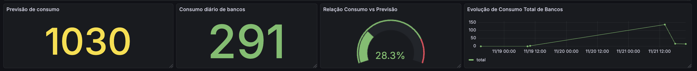
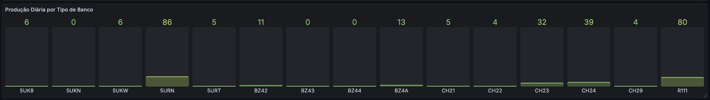
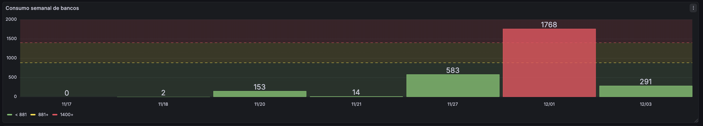
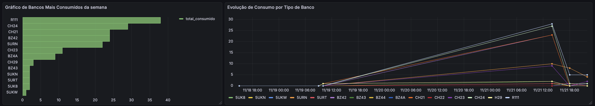
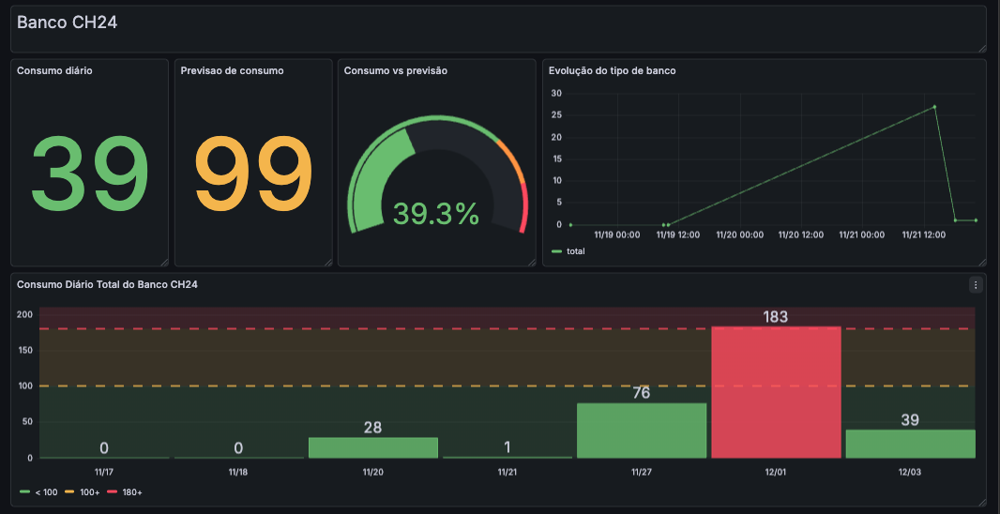
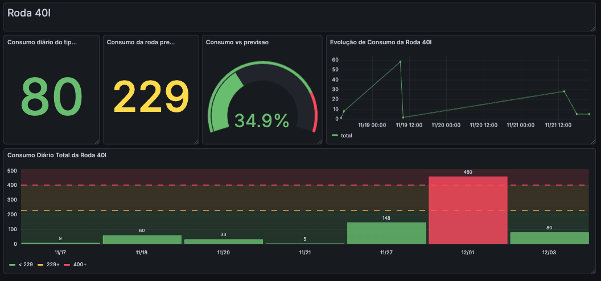

# Primeira Versao do Dashboard 
O dashboard foi desenvolvido para fornecer uma visão clara, intuitiva e confiável sobre o consumo diário de bancos e rodas no processo produtivo. Com ele, conseguimos identificar rapidamente quando o consumo está dentro do esperado, quando há picos inesperados, acompanhar o histórico e observar possíveis pontos de atenção, além de comparar o que de fato aconteceu com o que era previsto.

Sua estrutura foi dividida em duas seções, uma para bancos e uma para rodas. Como ambas seguem exatamente a mesma lógica, mudando só o tipo da peça, fizemos os mesmos gráficos e focamos aqui na tela de bancos. Dentro dela, o dashboard foi organizado com uma visão geral e outra que aprofunda o comportamento de cada modelo. A ideia é que a leitura comece pelo panorama geral e depois permita uma análise mais detalhada.

## 1.0 Vizualização Geral do consumo de bancos 

Figura 01 - Visão geral consumo de bancos

Source: Material produzido pelo Time Sem Parar, 2025.

### 1.1 Análise do consumo diário e evolução semanal

Figura 02 - Consumo diário e evolução semanal

Source: Material produzido pelo Time Sem Parar, 2025.

Começando pela subseção de visualização geral, temos uma área que resume o desempenho atual de forma simples e objetiva, usando valores intuitivos para facilitar a interpretação. A previsão exibida é calculada com base em uma média móvel recente, mostrando um padrão. Já o valor de consumo diário representa exatamente o quanto foi consumido no dia atual. Ao lado desses indicadores, tem um medidor circular que mostra a relação entre consumo real e a previsão, podendo assim identificar com clareza quanto do valor projetado já foi atingido e se o comportamento do dia está de acordo com o esperado ou não. 

Ao lado desses valores, há um gráfico que mostra a evolução total do consumo ao longo dos últimos dias. Essa linha ajuda a perceber padrões de comportamento, como quedas ou picos anormais, além de mostrar como o consumo vem se comportando à medida que o tempo passa. Ou seja, não serve apenas para ver quantidades, mas sim para entender tendências, o que ajuda no planejamento e previsão de possíveis problemas.

### 1.2 Consumo diário por tipo de banco

Figura 03 - Consumo diário por tipo de banco

Source: Material produzido pelo Time Sem Parar, 2025.

Um pouco abaixo, o dashboard mostra o desempenho individual de cada tipo de banco, exibindo quantas peças foram consumidas ao longo do dia. Estes cartões permitem identificar rapidamente quais modelos estão mais ativos na produção naquele momento. Além disso, a cor aplicada é para reforçar a interpretação: valores que se afastam do ideal vão ganhando tons mais próximos do vermelho, chamando a atenção para possíveis desvios. Essa progressão visual facilita identificar prioridades sem precisar fazer outros cálculos.

### 1.3 Consumo semanal de bancos e alertas 

Figura 04 - Consumo semanal de bancos e alertas

Source: Material produzido pelo Time Sem Parar, 2025.

Em seguida, há um gráfico que compara o volume total consumido por cada tipo de banco. Cada barra representa um modelo específico e seu tamanho mostra o quanto ele contribuiu para o consumo acumulado. Isso permite identificar de forma fácil quais tipos são mais representativos dentro da operação, ajudando a visualizar a concentração produtiva. Além disso, as faixas coloridas tem a função de facilitar essa interpretação: quando o consumo fica na região amarela, já existe um sinal de alerta, indicando que o valor está se aproximando de um nível indesejado; quando atinge a faixa vermelha, o comportamento passa a ser crítico e merece ainda mais atenção. Vale destacar que essas faixas coloridas, por enquanto, foram definidas com valores aproximados, servindo como uma referência inicial. Na próxima sprint, pretendemos tornar essas linhas mais precisas, calculando a faixa vermelha a partir da média da amostra (linha amarela) somada a dois desvios-padrão, o que dará um limite estatisticamente confiável para disparar alertas reais.

- **Alertas:**

Figura 05 - Alerta de limites atingidos

Source: Material produzido pelo Time Sem Parar, 2025.

No topo do sistema, ficam os alertas de monitoramento, que funcionam como uma camada extra de segurança. Eles entram em “Pending” quando identificam um possível excesso e esperam confirmação. Quando o limite é ultrapassado de fato, passam para “Firing”, indicando que houve um desvio relevante. Assim, situações críticas são percebidas de forma rápida e a equipe tem informação confiável para agir.

### 1.4 Distribuição e evolução do consumo semanal por tipos de bancos

Figura 06 - Distribuição por tipo de banco

Source: Material produzido pelo Time Sem Parar, 2025.

Além disso, o dashboard também traz uma comparação clara entre os modelos mais consumidos ao longo do período. Esse gráfico organiza os bancos em ordem  decrescente, ou seja, do mais utilizado para o menos utilizado, o que facilita visualizar quais modelos realmente pesam na operação. Ele ajuda a identificar concentrações de demanda, permitindo que a equipe perceba rapidamente se o processo está muito dependente de apenas alguns modelos. 

Ao lado desse comparativo, temos o gráfico de evolução individual por tipo de banco. Nele, cada linha representa um modelo específico, mostrando como o consumo variou ao longo do tempo. Esse gráfico é importante para perceber pontos que não são percebidos no valor acumulado, como oscilações, quedas repentinas, momentos de estabilidade ou picos fora do padrão.

## 2.0 Vizualização específica por tipo de banco

Figura 07 - Dados de consumo e análise do tipo de banco

Source: Material produzido pelo Time Sem Parar, 2025.

Por fim, o dashboard traz a possibilidade de aprofundar a análise em um tipo de banco específico, como é o caso do 5URT. Nessa área, o usuário pode selecionar o modelo que deseja pelo filtro superior e, então, todos os gráficos desta subseção são atualizados para mostrar apenas o comportamento daquele modelo em específico. Isso facilita muito a visualização, pois evita a necessidade de fazer filtros externos ou exportar dados manualmente.

Quando o modelo é selecionado, os primeiros valores apresentados são o consumo diário e a previsão associada, o que já dá uma noção de como aquele banco está se comportando naquele momento. Ao lado desses indicadores, o medidor circular mostra a relação entre o consumo atual e a média, ajudando a perceber se está dentro, abaixo ou acima do esperado.

Logo ao lado, há um gráfico de linha que mostra a evolução recente desse consumo ao longo do tempo. Esse gráfico ajuda a entender se o ritmo está aumentando, diminuindo ou se teve alguma variação pontual, como um pico específico em um dia isolado.

E, por último, o gráfico de barras mostra a distribuição do consumo diário ao longo dos dias, podendo identificar padrões como dias com alta atividade, dias com baixa utilização e dias totalmente nulos. Aqui também aparecem faixas de referência que quando a barra se aproxima ou ultrapassa a linha amarela, já é um sinal de alerta, e quando alcança a região vermelha,  a situação se torna ainda mais crítica e merece atenção.

## 3.0 Vizualização geral de rodas

Nesta parte temos a visualização do dashboard para rodas. Como já mencionamos anteriormente, ele segue exatamente a mesma lógica do painel de bancos, com os mesmos gráficos e interpretações. Por isso, não detalhamos novamente sua explicação, mas as imagens estão incluídas aqui para consulta e para facilitar a visualização.

Figura 08 - Distribuição por tipo de banco

Source: Material produzido pelo Time Sem Parar, 2025.

## 4.0 Vizualização específica por tipo de roda

Figura 09 - Vizualização por tipo de roda

Source: Material produzido pelo Time Sem Parar, 2025.

